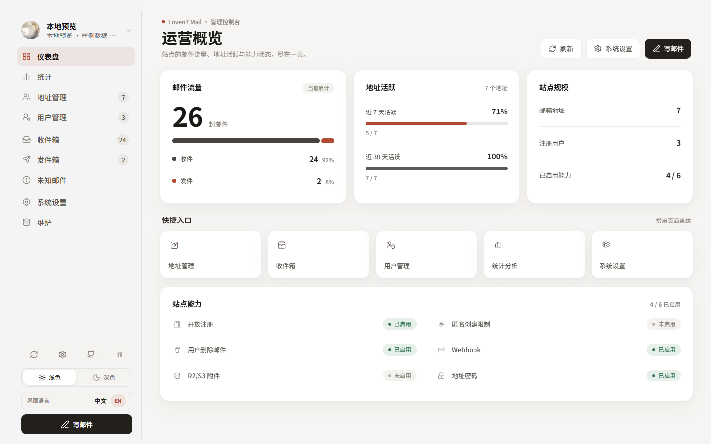
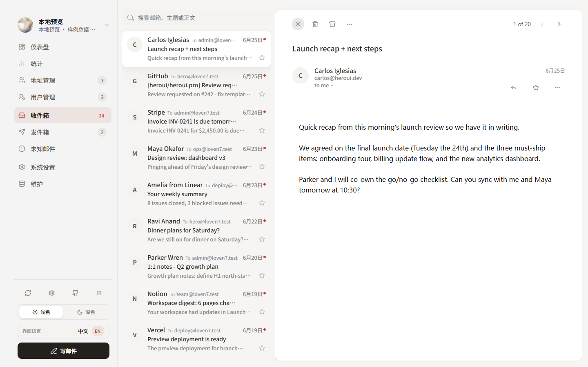
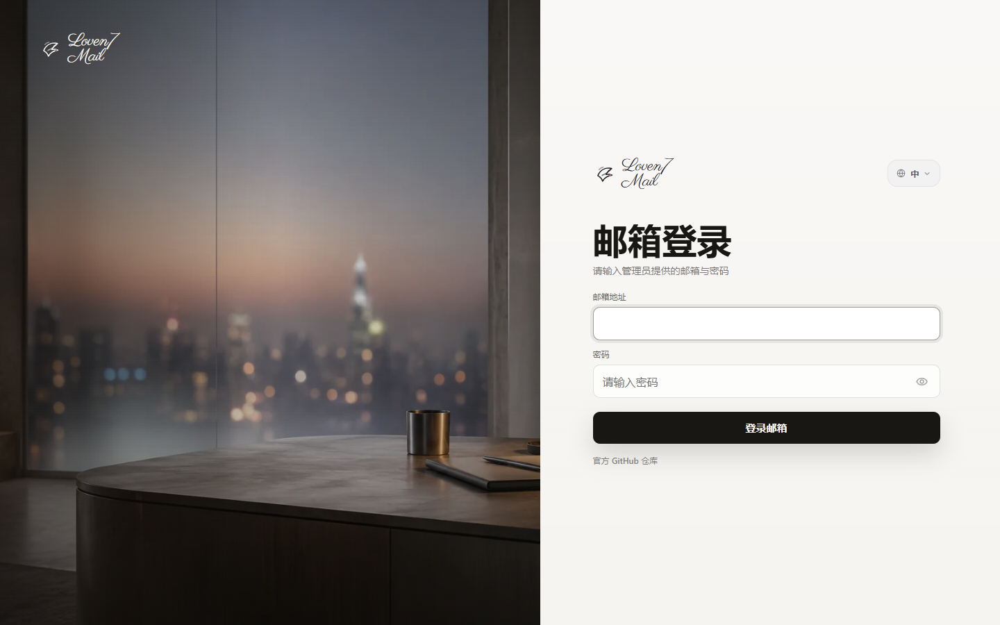
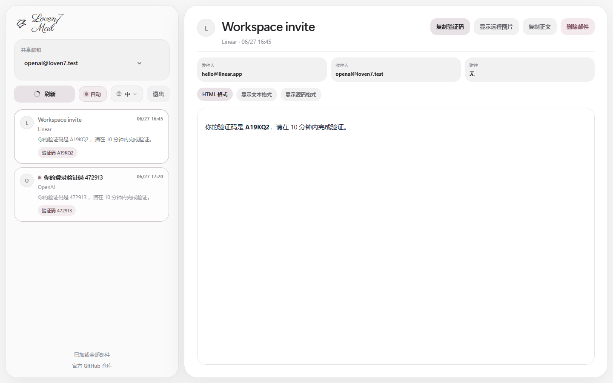
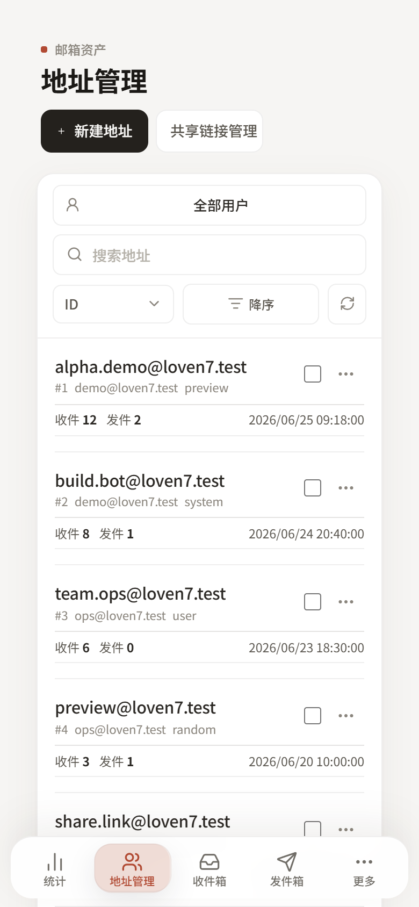
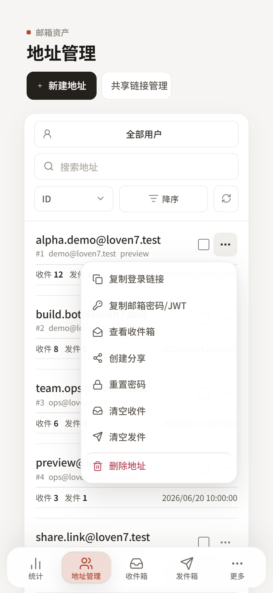

<div align="center">

<p><strong>简体中文</strong> · <a href="README_EN.md">English</a></p>


# Loven7 Mail

**开源、自托管、对新手友好的 Cloudflare 邮箱系统**

Worker · D1 · Admin · Webmail · 邮件分享 · 多域名 · Windows 一键安装器

<p>
  <a href="https://github.com/Lur1N77777/loven7-mail/releases/latest/download/Install-Loven7-Mail.cmd"></a>
  <a href="docs/BEGINNER_GUIDE.md"></a>
</p>

<p>
  <a href="https://github.com/Lur1N77777/loven7-mail/blob/main/LICENSE"></a>
  <a href="https://github.com/Lur1N77777/loven7-mail/actions/workflows/ci.yml"></a>
  
  
  
</p>

[三步开始](#-三步开始) · [界面预览](#%EF%B8%8F-界面预览) · [安装边界](#-安装器会自动完成什么) · [完整文档](#-文档导航) · [常见问题](#-常见问题)

</div>

> [!NOTE]
> Loven7 Mail 是一个独立维护和发布的开源项目。部署后的 Worker、D1、Pages 与 KV 全部运行在你自己的 Cloudflare 账号中，不依赖作者提供的托管实例。

## 🚀 三步开始

<table>
  <tr>
    <td width="33%" valign="top">
      <strong>① 下载一个文件</strong><br /><br />
      Windows 用户下载并双击 <a href="https://github.com/Lur1N77777/loven7-mail/releases/latest/download/Install-Loven7-Mail.cmd"><code>Install-Loven7-Mail.cmd</code></a>。<br /><br />
      <sub>无需 Git、无需克隆源码、无需预装 Node.js。</sub>
    </td>
    <td width="33%" valign="top">
      <strong>② 登录 Cloudflare</strong><br /><br />
      安装器会打开 Cloudflare 官方 OAuth。按提示选择账号，填写域名和首个管理员信息。<br /><br />
      <sub>密码不会显示，也不会写入仓库。</sub>
    </td>
    <td width="33%" valign="top">
      <strong>③ 接通真实邮件</strong><br /><br />
      安装器先部署并验收核心 Worker，再启用 Email Routing，将 Catch-all 绑定到它。<br /><br />
      <sub>你只需发送一封真实邮件完成验收。</sub>
    </td>
  </tr>
</table>



```mermaid
flowchart LR
  accTitle: Loven7 Mail 新手部署流程
  accDescr: Windows 用户下载单文件安装器，通过 Cloudflare 官方授权选择账号与域名，自动部署基础设施并接通 Email Routing Catch-all，最后完成真实收件测试。

  A["下载安装器"] --> B["Cloudflare OAuth"] --> C["选择 Active 域名"] --> D["部署并验收核心 Worker"] --> F["自动接通 Catch-all"] --> E["收到第一封真实邮件"]

  classDef entry fill:#eff6ff,stroke:#2563eb,color:#1e3a8a
  classDef deploy fill:#fff7ed,stroke:#ea580c,color:#7c2d12
  classDef finish fill:#f0fdf4,stroke:#16a34a,color:#14532d
  class A,B entry
  class C,D,F deploy
  class E finish
```

> [!IMPORTANT]
> 全新 Worker 模式会在你明确确认后修改必要的邮件 MX，并自动把 Catch-all 绑定到安装器 Worker。若域名已有 Catch-all、企业邮箱或其他冲突规则，安装器会停止并要求确认，绝不会静默覆盖。

## 🎯 选择你的入口

| 你现在的情况 | 最适合的入口 | 你会完成什么 |
| --- | --- | --- |
| 域名还没有托管到 Cloudflare | [域名托管与邮箱路由教程](docs/CLOUDFLARE_DOMAIN_AND_EMAIL.md) | 添加域名、修改 Nameserver、等待状态变为 Active |
| 域名已经在 Cloudflare 中显示 Active | [小白完整部署教程](docs/BEGINNER_GUIDE.md) | 从下载安装器到收到第一封真实邮件 |
| 已经有兼容的邮件 Worker | [部署速查](docs/DEPLOYMENT_QUICKSTART.md) | 复用后端，只部署 Admin 与 Webmail |
| 熟悉 Node.js，想从源码运行 | [安装器说明](docs/INSTALLER.md) | 克隆仓库后运行 `npm run setup` |

**开始前只需要：** 一个 Cloudflare 账号、至少一个已托管域名，以及可以管理该域名的权限。

## ✨ 你会得到什么

<table>
  <tr>
    <td width="33%" valign="top"><strong>📨 真实邮件接收</strong><br /><br />通过 Cloudflare Email Routing 接收公网邮件，支持多个邮箱域名。</td>
    <td width="33%" valign="top"><strong>🧭 管理后台</strong><br /><br />统一管理地址、用户、收件箱、未知邮件、发件箱、分享与系统设置。</td>
    <td width="33%" valign="top"><strong>💌 用户邮箱</strong><br /><br />独立 Webmail、密码登录、自动刷新、验证码识别、已读与星标同步。</td>
  </tr>
  <tr>
    <td width="33%" valign="top"><strong>🔗 邮件分享</strong><br /><br />创建单邮箱、多邮箱和聚合分享，支持过期、撤回与访客隐藏。</td>
    <td width="33%" valign="top"><strong>🛡️ 安全默认值</strong><br /><br />HTML 沙箱、远程图片保护、Secret 隔离、发行包 SHA-256 校验。</td>
    <td width="33%" valign="top"><strong>🪄 新手安装器</strong><br /><br />自动准备 Node.js、创建 Cloudflare 资源、写入 Secret，并执行在线验收。</td>
  </tr>
</table>

## 🖼️ 界面预览

### Admin · 管理与运营

<table>
  <tr>
    <td width="50%" valign="top">
      <strong>运营概览</strong><br />
      <sub>邮件流量、地址活跃、站点规模与运行能力一目了然。</sub><br /><br />
      <a href="docs/screenshots/admin-dashboard.png"></a>
    </td>
    <td width="50%" valign="top">
      <strong>收件箱工作区</strong><br />
      <sub>高密度邮件列表、阅读器和常用操作集中在一个页面。</sub><br /><br />
      <a href="docs/screenshots/admin-inbox.png"></a>
    </td>
  </tr>
</table>

### Webmail · 登录与分享

<table>
  <tr>
    <td width="50%" valign="top">
      <a href="docs/screenshots/webmail-login.png"></a>
    </td>
    <td width="50%" valign="top">
      <a href="docs/screenshots/webmail-share.png"></a>
    </td>
  </tr>
</table>

### 移动端 · 完整功能不缩水

<p align="center">
  <a href="docs/screenshots/mobile-address-list.png"></a>
  &nbsp;&nbsp;
  <a href="docs/screenshots/mobile-address-actions.png"></a>
</p>

## 📦 安装器会自动完成什么

| 自动完成 | 仍需你手动完成 |
| --- | --- |
| 准备 Node.js 22 和必要的便携工具 | 将域名托管到 Cloudflare，并等待状态变为 Active |
| 通过 Wrangler 官方 OAuth 登录并核验域名归属 | 确认域名没有正在使用的企业邮箱或其他收件服务 |
| 先创建并验收不接管邮件的核心 Worker、D1 | 在安装器风险提示中明确同意邮件接管 |
| 自动启用 Email Routing 和必要邮件 DNS | 冲突时决定是否接管已有 Catch-all |
| 将每个域名的 Catch-all 绑定到安装器 Worker | 从 Gmail、Outlook 或 QQ 邮箱发送真实测试邮件 |
| 创建 Pages 与 KV，并检查 Admin、Webmail 和 `/api/runtime` | 如需发件，另行配置发件服务 |

<div align="center">

### 准备开始？

[](https://github.com/Lur1N77777/loven7-mail/releases/latest/download/Install-Loven7-Mail.cmd)

遇到任何不确定的页面，按[小白完整部署教程](docs/BEGINNER_GUIDE.md)逐步操作即可。

</div>

## 🧩 系统组成

| 组件 | 作用 | 部署位置 |
| --- | --- | --- |
| Mail Worker | 收件、地址、用户、邮件与管理员 API | 你的 Cloudflare Workers |
| D1 | 保存邮件与业务数据 | 你的 Cloudflare D1 |
| Admin | 管理地址、用户、邮件、分享和系统设置 | 你的 Cloudflare Pages |
| Webmail | 用户登录、阅读邮件和打开分享链接 | 你的 Cloudflare Pages |
| KV | 保存分享数据，以及可选的已读/星标状态 | 你的 Cloudflare KV |

全新部署会下载并校验锁定的兼容 Worker 源码，再部署到用户自己的 Cloudflare 账号。后端来源、版本锁定和独立项目边界见[产品边界与后端来源](docs/UPSTREAM.md)。

## 📚 文档导航

| 文档 | 适合什么时候看 |
| --- | --- |
| [小白完整部署教程](docs/BEGINNER_GUIDE.md) | 第一次部署，从零开始直到收到真实邮件 |
| [Cloudflare 域名与邮箱路由](docs/CLOUDFLARE_DOMAIN_AND_EMAIL.md) | 域名未托管，或自动路由失败、发生冲突 |
| [部署速查](docs/DEPLOYMENT_QUICKSTART.md) | 已了解 Cloudflare，只需要最短操作清单 |
| [新手安装器说明](docs/INSTALLER.md) | 查看安装器行为、断点重试和安全边界 |
| [Email Routing 速查](docs/EMAIL_ROUTING.md) | 核验自动配置结果，或手动排查收不到邮件 |
| [Cloudflare Pages 配置](docs/CLOUDFLARE_PAGES.md) | 手动维护变量、KV、Preview 或排查运行时 |
| [配置边界](docs/CONFIGURATION_BOUNDARY.md) | 区分公开源码与自己的生产配置 |
| [版本策略](docs/VERSIONING.md) · [CHANGELOG](CHANGELOG.md) | 升级或发版前确认兼容变化 |
| [项目结构](docs/PROJECT_STRUCTURE.md) | 准备参与开发或理解模块职责 |

## 🔍 常见问题

<details>
<summary><strong>安装完成后为什么还收不到邮件？</strong></summary>

全新 Worker 安装器正常完成时，Email Routing 和 Catch-all 已经自动配置；先发送一封来自外部邮箱的真实测试邮件。如果仍收不到，按[Email Routing 速查](docs/EMAIL_ROUTING.md)核对 MX、Catch-all 和 Worker Logs。已有 Worker 模式仍要求后端原本就具备可用的邮件路由。

</details>

---

<details>
<summary><strong>为什么不需要先拿到 Worker 地址再配置域名？</strong></summary>

Cloudflare Email Routing 绑定的是 **Worker 服务名称**，不是 `*.workers.dev` URL。域名仍需在 OAuth 后填写，因为 Worker 的可用域名、默认域名和管理员权限都依赖它；`workers.dev` 地址主要供 Admin 和 Webmail 调用后端。

现在的实际顺序更保守：输入域名时只生成 `DOMAINS`、默认域名和管理员角色配置，不会立即修改 DNS。安装器会先使用**不含 `addresses`** 的配置部署核心 Worker、写入 Secret、取得 `workers.dev` 地址并完成健康与管理员验收；这些都成功后，才启用 Email Routing/MX，再使用含 `addresses = ["*@域名"]` 的配置进行第二次部署并在线确认 Catch-all。

</details>

---

<details>
<summary><strong>它能直接发送邮件吗？</strong></summary>

默认完整覆盖收件、Admin、Webmail、分享和已读/星标同步。发件需要你另外选择并配置 Resend、SMTP 或 Cloudflare Send Email；安装器不会自动创建第三方发件账号，也不会猜测或写入发件凭据。

</details>

---

<details>
<summary><strong>macOS 或 Linux 能一键安装吗？</strong></summary>

当前“下载后双击”的单文件入口面向 Windows。macOS 与 Linux 用户可以安装 Node.js 22，克隆仓库后运行 `npm run setup`，使用的是同一套安装流程。

</details>

---

<details>
<summary><strong>域名已经有企业邮箱，还能使用吗？</strong></summary>

需要谨慎。修改 MX 记录可能影响现有邮箱服务。建议使用一个独立域名或专门的子域方案进行部署，并在修改前确认当前邮件服务商的路由要求。

</details>

---

<details>
<summary><strong>这个项目是否依赖原项目在线运行？</strong></summary>

不依赖任何上游托管实例。Loven7 Mail 独立维护品牌、Admin、Webmail、Pages Functions、安装器、发行包和文档；首次创建新 Worker 时，会下载并校验锁定版本的兼容后端源码，然后将全部运行资源部署到你自己的 Cloudflare 账号。详情见[产品边界与后端来源](docs/UPSTREAM.md)。

</details>

---

## 🛠️ 维护者与开发者

<details>
<summary><strong>从源码运行安装器</strong></summary>

要求 Node.js 22+：

```bash
git clone https://github.com/Lur1N77777/loven7-mail.git
cd loven7-mail
npm run setup
```

只查看安装计划、不连接 Cloudflare：

```bash
npm run setup:plan
```

</details>

---

<details>
<summary><strong>本地开发与发布检查</strong></summary>

```bash
npm --prefix apps/admin ci
npm --prefix apps/webmail ci
npm --prefix apps/admin run dev
```

另开一个终端启动 Webmail：

```bash
npm --prefix apps/webmail run dev
```

提交前运行：

```bash
npm run check:public
npm run check:release
```

</details>

---

<details>
<summary><strong>手动接入已有 Worker</strong></summary>

已有兼容 Worker 时，可以只部署两个 Pages 前端。Production 环境需要配置 `MAIL_WORKER_BASE_URL`、`SHARE_ENCRYPTION_SECRET_V2`（旧记录可继续使用 `SHARE_ENCRYPTION_SECRET`）、`SHARE_ADMIN_CORS_ORIGINS` 与 `SHARE_KV`，并让 Admin 通过同域 Pages Functions 代理访问 Worker。

复用已有 Pages 项目时，请显式设置 `ADMIN_PAGES_PROJECT_NAME` 和 `WEBMAIL_PAGES_PROJECT_NAME`。Preview 环境的变量、Secret 与 KV 绑定需要单独配置；确认完整后再设置 `WEBMAIL_PREVIEW_RUNTIME_CONFIRMED=1`。部署后可运行 `npm run check:cloudflare:runtime` 做只读探测。完整变量表和验收步骤见[部署速查](docs/DEPLOYMENT_QUICKSTART.md)与[Cloudflare Pages 文档](docs/CLOUDFLARE_PAGES.md)。

</details>

---

## 🤝 开源与安全

Loven7 Mail 使用 [MIT License](LICENSE)。欢迎提交 Issue 和 PR；参与贡献前请阅读 [CONTRIBUTING.md](CONTRIBUTING.md)。安全问题请不要公开披露，请按 [SECURITY.md](SECURITY.md) 中的方式报告。

感谢 [LinuxDo 社区](https://linux.do/) 对开源交流和开发者协作的支持。
