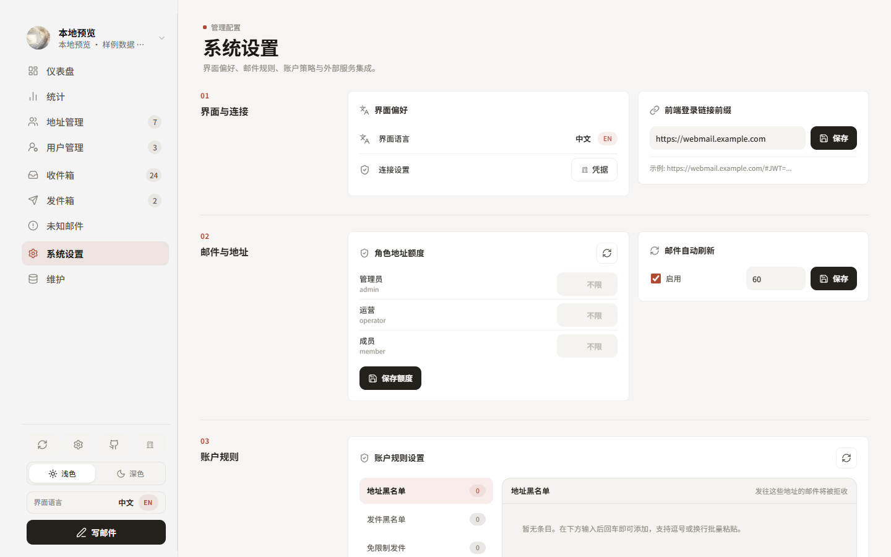
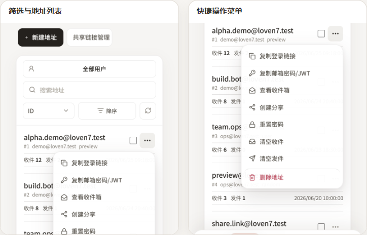

<div align="center">


# Loven7 Mail Cloudflare Suite

一套面向 Cloudflare Temp Mail / `cloudflare_temp_email` 的现代化双站前端：管理后台、用户邮箱、分享链接与 Pages Functions 集中维护。

<p>
  <a href="https://github.com/Lur1N77777/loven7-mail-cloudflare-suite/blob/main/LICENSE"></a>
  
  
  
  <a href="https://github.com/Lur1N77777/loven7-mail-cloudflare-suite/actions/workflows/ci.yml"></a>
</p>

[界面预览](#界面预览) · [5 分钟部署](#5-分钟部署) · [功能](#功能) · [手动部署](#手动部署) · [配置边界](#公开版与自用配置边界) · [文档](#文档)

</div>

> 这是可复用的公开版前端仓库，不包含任何部署者的 Worker 地址、Cloudflare 资源 ID、域名、账号、密码、Token、密钥或生产运维记录。所有私有值都在部署平台或浏览器中注入。

## v0.3.0 · 大前端更新

管理后台完成一次完整的视觉与工作区重构，采用 **Paper, Ink & Sealing Wax** 设计语言：暖灰纸面、墨黑主操作与陶土红强调色贯穿仪表盘、统计、地址、用户、收发件、系统设置和维护页面。

- 桌面端重新组织信息层级、指标卡片、管理表格和工具面板。
- 平板与移动端补齐专用布局、底部导航、快捷操作菜单和无横向溢出体验。
- 深色模式、表单控件、分页、弹层和代码面板使用统一的圆角与表面规范。
- 保持现有 Worker API、Pages 运行时变量和 KV 数据结构不变，可从旧版本平滑升级。

## 界面预览

### Admin · Paper, Ink & Sealing Wax

<table>
  <tr>
    <td width="50%" valign="top">
      <strong>运营概览</strong><br />
      <sub>邮件流量、地址活跃、站点规模与能力状态。</sub><br /><br />
      
    </td>
    <td width="50%" valign="top">
      <strong>收件箱工作区</strong><br />
      <sub>高密度邮件列表、阅读器与快捷操作。</sub><br /><br />
      
    </td>
  </tr>
</table>

<table>
  <tr>
    <td width="50%" valign="top">
      <strong>系统设置</strong><br />
      <sub>界面、连接、邮件规则和账户策略分区管理。</sub><br /><br />
      
    </td>
    <td width="50%" valign="top">
      <strong>移动端地址管理</strong><br />
      <sub>响应式列表、底部导航和地址快捷操作，采用紧凑画廊避免竖图撑高页面。</sub><br /><br />
      
    </td>
  </tr>
</table>

### Webmail · 登录与分享

<table>
  <tr>
    <td width="50%" valign="top"></td>
    <td width="50%" valign="top"></td>
  </tr>
</table>

## 项目组成

| 应用 | 目录 | 作用 |
| --- | --- | --- |
| Admin | `apps/admin` | 地址、用户、收发件、分享、系统设置与维护工具 |
| Webmail | `apps/webmail` | 用户登录、邮箱阅读、单/多邮箱分享与 Pages Functions |

本仓库只提供前端和 Pages Functions。你需要先部署兼容的 Cloudflare Temp Mail / `cloudflare_temp_email` Worker；数据库、邮件路由和 Worker 迁移均由后端项目负责。

## 功能

- 管理后台：仪表盘、地址/用户管理、收件箱、未知邮件、发件箱、分享管理与维护入口。
- 用户邮箱：邮箱密码/JWT 登录、自动刷新、验证码识别与复制、移动端自适应。
- 分享能力：单邮箱、多邮箱、聚合分享、仅新增邮件、撤回、过期与访客隐藏。
- 邮件安全：HTML 沙箱、远程图片保护、附件处理、品牌头像代理与请求预算。
- 工程能力：TypeScript、PWA、双 Pages 构建、运行时诊断、CI、脱敏门禁和发布检查。

## 5 分钟部署

最省心的方式是把下面整段一次性交给能操作 GitHub 和 Cloudflare 的 AI Agent。开始前先在浏览器登录 GitHub 与 Cloudflare，并准备好现有 Worker 的运行时配置；不要把任何密码或 Token 发进聊天。

```text
请严格按照仓库 docs/AGENT_DEPLOY_PROMPT.md，把当前仓库从只读预检到两个 Production 站点验收作为一个连续任务一次完成；不要在计划、预检、创建第一个站点或单次部署后结束。不得修改或重新部署上游邮件 Worker，不得要求我在聊天中发送任何密码、Token、Worker 私有地址或加密密钥，不得输出密钥原文。除 GitHub/Cloudflare 登录、由我在平台页面一次性填写全部 Secret，以及真实账号最终验收外，不要逐阶段停下征求确认；需要我操作时一次列出全部事项，我回复“已配置”后从断点继续。先部署 Admin 并取得最终 origin，再用该 origin 配置 Webmail 的 SHARE_ADMIN_CORS_ORIGINS、SHARE_KV 和分享密钥，然后部署 Webmail。完成构建、两个 Pages 部署、/api/runtime 探针和回滚点记录后，再统一报告两个站点 URL、证据、未完成项和回滚方法。
```

完整、可直接复制的强约束提示词见 [AI Agent 部署指令](docs/AGENT_DEPLOY_PROMPT.md)。如果你更喜欢自己操作，继续阅读下一节。

## 手动部署

### 1. 准备

- 一个可用的 Cloudflare 账号。
- 一个已部署且 API 兼容的邮件 Worker。
- 将本仓库 Fork 到你自己的 GitHub 账号。

### 2. 创建 Admin Pages

在 Cloudflare Dashboard 打开 **Workers & Pages → Create → Pages → Connect to Git**，选择你的 Fork：

| 设置 | 值 |
| --- | --- |
| Project name | `loven7-mail-admin`（可自定义） |
| Root directory | `apps/admin` |
| Build command | `npm ci && npm run build` |
| Build output directory | `dist` |

然后在 Admin Pages 的 **Settings → Variables and Secrets → Production** 设置：

| 名称 | 类型 | 说明 |
| --- | --- | --- |
| `MAIL_WORKER_BASE_URL` | Secret | 你的邮件 Worker 根地址，例如 `https://worker.example.com` |
| `ADMIN_PASSWORD` | Secret | Worker 的管理员密码，仅由 Pages Functions 使用 |
| `SITE_PASSWORD` | Secret，可选 | Worker 开启站点密码时填写 |

不要设置 `VITE_API_BASE`。默认同域 Pages Functions 代理能避免把管理员密码打进浏览器构建产物。

### 3. 创建 Webmail Pages

先等待 Admin 的 Production 部署完成并记录实际 origin；Webmail 的 CORS 配置必须使用这个地址，不能提前猜测，也不能填写 Webmail 自己的 origin。

再次导入同一个 Fork：

| 设置 | 值 |
| --- | --- |
| Project name | `loven7-mail-webmail`（可自定义） |
| Root directory | `apps/webmail` |
| Build command | `npm ci && npm run build` |
| Build output directory | `dist` |

在 Webmail Pages 的 **Production** 运行时设置中添加：

| 名称 | 类型 | 说明 |
| --- | --- | --- |
| `MAIL_WORKER_BASE_URL` | Secret | 与 Admin 相同的 Worker 根地址 |
| `SITE_PASSWORD` | Secret，可选 | Worker 开启站点密码时填写 |
| `SHARE_ENCRYPTION_SECRET_V2` | Secret | 至少 32 字节的高熵随机值；新部署推荐只写 V2 |
| `SHARE_ADMIN_CORS_ORIGINS` | Variable | Admin 的完整 origin，例如 `https://admin.example.com`；禁止 `*` |

在 **Settings → Bindings → KV namespace bindings** 创建或选择一个 KV Namespace，绑定名必须是 `SHARE_KV`。如需 Admin 与 Webmail 跨设备共享已读/星标状态，再给两个项目绑定同一个 KV，绑定名均为 `MAIL_READ_STATE_KV`。

Preview 与 Production 的变量、Secret 和 KV 绑定相互独立。需要预览完整功能时，请在 Preview 环境重复配置；否则只使用 Production。

使用直接上传脚本复用已有项目时，显式设置 `ADMIN_PAGES_PROJECT_NAME` 和 `WEBMAIL_PAGES_PROJECT_NAME`。只有确认 Preview 已配置完整运行时后，才设置本地确认标记 `WEBMAIL_PREVIEW_RUNTIME_CONFIRMED=1`。

### 4. 验收

如果 Pages 项目在运行时配置完成前已经自动构建，先各触发一次新的 Production 部署。随后依次检查：

1. 打开 Webmail 的 `/api/runtime`，确认 `ok: true`；接口只报告配置状态，不返回 Secret。
2. 使用上游用户账号登录 Admin，确认仪表盘和收件箱可加载。
3. 在 Admin 的“系统设置 → 前端登录链接前缀”填写 Webmail URL，例如 `https://webmail.example.com`。
4. 新建一条分享链接并在无痕窗口打开，确认邮件列表正常。

如 `/api/runtime` 不完整，按返回的 `missing` 和 `hints` 补配置后重新部署。

## 本地开发

要求 Node.js 22+。两个应用独立安装依赖：

```bash
npm --prefix apps/admin ci
npm --prefix apps/webmail ci
npm --prefix apps/admin run dev
```

另开一个终端启动 Webmail：

```bash
npm --prefix apps/webmail run dev
```

提交前运行完整检查：

```bash
npm run check:public
npm run check:release
```

部署后可执行只读运行时探针：

```bash
WEBMAIL_RUNTIME_URL=https://webmail.example.com npm run check:cloudflare:runtime
```

## 公开版与自用配置边界

公开仓库只保存通用代码、示例占位符和可复用文档；自用信息只存在于 Cloudflare/GitHub Secret、部署平台变量或本机 ignored 文件。

| 可以提交 | 不得提交 |
| --- | --- |
| `*.example`、`.dev.vars.example`、注释掉的 KV 占位符 | `.env`、`.dev.vars`、真实 Worker/站点域名 |
| 通用 Pages 项目名和构建说明 | Cloudflare Account ID、KV/D1/R2 ID |
| Loven7 品牌、通用截图和示例数据 | 密码、Token、JWT、Cookie、分享密钥 |
| 通用排错与升级说明 | 自用生产清单、内部审计报告、客户或真实邮箱数据 |

边界、同步方法和私有 overlay 建议见 [公开版与私有配置边界](docs/CONFIGURATION_BOUNDARY.md)。`npm run check:public` 会在 CI 中阻止常见私人域名、本机路径和生产材料重新进入公开仓库。

## 版本与升级

项目遵循 Semantic Versioning：修复用 PATCH，向后兼容功能用 MINOR，破坏性配置/API 变化用 MAJOR。每次升级先阅读 [CHANGELOG](CHANGELOG.md)，在 Preview 环境验证，再升级 Production。

公开代码与自用配置分离后，升级只同步源码；不要把生产变量反向复制到公开分支。完整策略见 [版本策略](docs/VERSIONING.md)。

## 文档

| 文档 | 用途 |
| --- | --- |
| [部署速查](docs/DEPLOYMENT_QUICKSTART.md) | 最短的人工部署清单 |
| [AI Agent 部署指令](docs/AGENT_DEPLOY_PROMPT.md) | 强约束、分阶段、可验收的完整提示词 |
| [Cloudflare Pages](docs/CLOUDFLARE_PAGES.md) | 变量、KV、Preview、探针与排错 |
| [GitHub Actions](docs/GITHUB_ACTIONS.md) | CI 与可选自动部署 |
| [配置边界](docs/CONFIGURATION_BOUNDARY.md) | 公开源码和自用配置如何长期分离 |
| [版本策略](docs/VERSIONING.md) | 发版、升级与兼容约定 |
| [项目结构](docs/PROJECT_STRUCTURE.md) | 模块职责和维护入口 |
| [安全脱敏](docs/SECURITY_DESENSITIZATION.md) | 发布前检查与响应流程 |
| [上游关系](docs/UPSTREAM.md) | 与邮件 Worker 的职责边界 |

## 开源与安全

MIT License。欢迎 Issue 和 PR；贡献前请阅读 [CONTRIBUTING.md](CONTRIBUTING.md)。安全问题请不要公开披露，按 [SECURITY.md](SECURITY.md) 的方式报告。

感谢 [LinuxDo 社区](https://linux.do/) 对开源交流和开发者协作的支持。
