<div align="center">

<p><a href="README.md">简体中文</a> · <strong>English</strong></p>


# Loven7 Mail

**An open-source, self-hosted Cloudflare email system built for beginners**

Worker · D1 · Admin · Webmail · Mail sharing · Multiple domains · One-file Windows installer

<p>
  <a href="https://github.com/Lur1N77777/loven7-mail/releases/latest/download/Install-Loven7-Mail.cmd"></a>
  <a href="docs/BEGINNER_GUIDE_EN.md"></a>
</p>

<p>
  <a href="https://github.com/Lur1N77777/loven7-mail/blob/main/LICENSE"></a>
  <a href="https://github.com/Lur1N77777/loven7-mail/actions/workflows/ci.yml"></a>
  
  
  
</p>

[Quick start](#-quick-start) · [Interface preview](#%EF%B8%8F-interface-preview) · [Installer scope](#-what-the-installer-automates) · [Documentation](#-documentation) · [FAQ](#-faq)

</div>

> [!NOTE]
> Loven7 Mail is independently maintained and released. Your Worker, D1 database, Pages projects, and KV namespaces run entirely inside your own Cloudflare account. The deployed system does not depend on a hosted service operated by this project.

## 🚀 Quick start

<table>
  <tr>
    <td width="33%" valign="top">
      <strong>1. Download one file</strong><br /><br />
      On Windows, download and double-click <a href="https://github.com/Lur1N77777/loven7-mail/releases/latest/download/Install-Loven7-Mail.cmd"><code>Install-Loven7-Mail.cmd</code></a>.<br /><br />
      <sub>No Git clone, preinstalled Node.js, or Wrangler setup is required.</sub>
    </td>
    <td width="33%" valign="top">
      <strong>2. Sign in to Cloudflare</strong><br /><br />
      The installer opens Cloudflare's official OAuth flow. Select your account, then enter your mail domains and first administrator account.<br /><br />
      <sub>Passwords are hidden and are never committed to the repository.</sub>
    </td>
    <td width="33%" valign="top">
      <strong>3. Receive a real email</strong><br /><br />
      The installer deploys and verifies the core Worker before enabling Email Routing and binding Catch-all to it.<br /><br />
      <sub>Finish by sending one real message from an external mailbox.</sub>
    </td>
  </tr>
</table>

The same `Install-Loven7-Mail.cmd` supports both Chinese and English. Choose a language at startup and the download, authorization, deployment, errors, and final checks stay in that language. For automation or reruns, use `--lang zh-CN` or `--lang en`.

```mermaid
flowchart LR
  accTitle: Loven7 Mail beginner deployment
  accDescr: Download the one-file Windows installer, authorize Cloudflare, select active domains, deploy and verify the infrastructure, connect Email Routing Catch-all, and receive the first real email.

  A["Download installer"] --> B["Cloudflare OAuth"] --> C["Select Active domains"] --> D["Deploy and verify core Worker"] --> F["Connect Catch-all"] --> E["Receive a real email"]

  classDef entry fill:#eff6ff,stroke:#2563eb,color:#1e3a8a
  classDef deploy fill:#fff7ed,stroke:#ea580c,color:#7c2d12
  classDef finish fill:#f0fdf4,stroke:#16a34a,color:#14532d
  class A,B entry
  class C,D,F deploy
  class E finish
```



> [!IMPORTANT]
> A new-Worker installation changes the required mail MX records and binds Catch-all only after you explicitly approve mail takeover. If the domain already has a Catch-all rule, business mail service, or another conflicting route, the installer stops for confirmation. It does not silently overwrite an existing mail setup.

## 🎯 Choose the right starting point

| Your situation | Start here | What you will complete |
| --- | --- | --- |
| Your domain is not yet managed by Cloudflare | [Cloudflare domain and Email Routing guide](docs/CLOUDFLARE_DOMAIN_AND_EMAIL_EN.md) | Add the domain, change nameservers, and wait for the status to become Active |
| Your domain already shows Active in Cloudflare | [Complete beginner deployment guide](docs/BEGINNER_GUIDE_EN.md) | Go from downloading the installer to receiving the first real email |
| You already run a compatible mail Worker | [Deployment quick reference](docs/DEPLOYMENT_QUICKSTART.md) | Reuse the backend and deploy only Admin and Webmail; this reference is currently in Chinese |
| You prefer a source-based installation | [Installer reference](docs/INSTALLER.md) | Clone the repository and run `npm run setup`; this reference is currently in Chinese |

**Before you begin:** prepare a Cloudflare account, at least one domain already hosted by Cloudflare, and permission to manage that domain.

## ✨ What you get

<table>
  <tr>
    <td width="33%" valign="top"><strong>📨 Real email delivery</strong><br /><br />Receive public internet email through Cloudflare Email Routing, with support for multiple mail domains.</td>
    <td width="33%" valign="top"><strong>🧭 Admin console</strong><br /><br />Manage addresses, users, inboxes, unknown mail, sent mail, shares, and system settings.</td>
    <td width="33%" valign="top"><strong>💌 User Webmail</strong><br /><br />Password login, automatic refresh, verification-code detection, and synchronized read/star state.</td>
  </tr>
  <tr>
    <td width="33%" valign="top"><strong>🔗 Mail sharing</strong><br /><br />Create single-mailbox, multi-mailbox, and aggregate shares with expiry, revocation, and visitor-side hiding.</td>
    <td width="33%" valign="top"><strong>🛡️ Secure defaults</strong><br /><br />Sandboxed mail HTML, remote-image protection, secret isolation, and SHA-256 verification for release packages.</td>
    <td width="33%" valign="top"><strong>🪄 Beginner installer</strong><br /><br />Prepare Node.js, create Cloudflare resources, upload secrets, and perform live deployment checks.</td>
  </tr>
</table>

## 🖼️ Interface preview

### Admin · operations and management

<table>
  <tr>
    <td width="50%" valign="top">
      <strong>Operations dashboard</strong><br />
      <sub>Mail traffic, active addresses, site scale, and enabled capabilities in one view.</sub><br /><br />
      <a href="docs/screenshots/admin-dashboard.png"></a>
    </td>
    <td width="50%" valign="top">
      <strong>Inbox workspace</strong><br />
      <sub>A dense mail list, reader, and common actions in one workspace.</sub><br /><br />
      <a href="docs/screenshots/admin-inbox.png"></a>
    </td>
  </tr>
</table>

### Webmail · login and sharing

<table>
  <tr>
    <td width="50%" valign="top">
      <a href="docs/screenshots/webmail-login.png"></a>
    </td>
    <td width="50%" valign="top">
      <a href="docs/screenshots/webmail-share.png"></a>
    </td>
  </tr>
</table>

### Mobile · complete features on smaller screens

<p align="center">
  <a href="docs/screenshots/mobile-address-list.png"></a>
  &nbsp;&nbsp;
  <a href="docs/screenshots/mobile-address-actions.png"></a>
</p>

## 📦 What the installer automates

| Automated by the installer | Still requires your decision or action |
| --- | --- |
| Prepare Node.js 22 and required portable tools | Add the domain to Cloudflare and wait until it shows Active |
| Sign in through Wrangler OAuth and verify domain ownership | Confirm that the domain is not still used by business mail or another receiving service |
| Create and verify the core Worker and D1 before taking over mail | Explicitly approve mail takeover when the installer displays the risk |
| Enable Email Routing and required mail DNS records | Decide whether to replace an existing conflicting Catch-all rule |
| Bind every domain's Catch-all to the installed Worker | Send a real test message from Gmail, Outlook, QQ Mail, or another external provider |
| Create Pages and KV, then check Admin, Webmail, and `/api/runtime` | Configure a separate outbound provider if you need to send email |

<div align="center">

### Ready to deploy?

[](https://github.com/Lur1N77777/loven7-mail/releases/latest/download/Install-Loven7-Mail.cmd)

Follow the [complete beginner guide](docs/BEGINNER_GUIDE_EN.md) whenever a Cloudflare screen or installer prompt is unfamiliar.

</div>

## 🧩 Architecture

| Component | Responsibility | Runs in |
| --- | --- | --- |
| Mail Worker | Receiving mail, address/user APIs, mail storage APIs, and administrator APIs | Your Cloudflare Workers account |
| D1 | Mail and application data | Your Cloudflare D1 |
| Admin | Address, user, mail, share, and system management | Your Cloudflare Pages |
| Webmail | User login, reading mail, and opening shared mail | Your Cloudflare Pages |
| KV | Shared-mail data and optional synchronized read/star state | Your Cloudflare KV |

A new installation downloads and verifies a pinned compatible Worker source, then deploys every runtime resource into your Cloudflare account. The backend source and independent-project boundary are documented in [Project and upstream boundary](docs/UPSTREAM.md) (Chinese).

## 📚 Documentation

| Document | Use it when |
| --- | --- |
| [Complete beginner deployment guide](docs/BEGINNER_GUIDE_EN.md) | This is your first deployment and you want every step through real mail delivery |
| [Cloudflare domain and Email Routing](docs/CLOUDFLARE_DOMAIN_AND_EMAIL_EN.md) | The domain is not yet hosted by Cloudflare, or automatic routing needs troubleshooting |
| [Deployment quick reference](docs/DEPLOYMENT_QUICKSTART.md) | You understand Cloudflare and need a short checklist; currently Chinese |
| [Installer reference](docs/INSTALLER.md) | You need details about resume checkpoints, resource reuse, and safety boundaries; currently Chinese |
| [Email Routing reference](docs/EMAIL_ROUTING.md) | You need to verify MX, Catch-all, or Worker Logs; currently Chinese |
| [Cloudflare Pages configuration](docs/CLOUDFLARE_PAGES.md) | You maintain variables, KV, previews, or runtime settings manually; currently Chinese |
| [Versioning](docs/VERSIONING.md) · [CHANGELOG](CHANGELOG.md) | You are upgrading or preparing a release |
| [Project structure](docs/PROJECT_STRUCTURE.md) | You plan to contribute or understand module ownership; currently Chinese |

## 🔍 FAQ

<details>
<summary><strong>The installation completed, but no email arrives. What should I check?</strong></summary>

A successful new-Worker installation already enables Email Routing and binds Catch-all. Send a real message from an external provider first. If it still does not arrive, use the [Cloudflare domain and Email Routing guide](docs/CLOUDFLARE_DOMAIN_AND_EMAIL_EN.md#-troubleshooting-no-mail) to verify MX records, Catch-all, the selected Worker, and Worker Logs. Existing-Worker mode still requires the reused backend to have working mail routing.

</details>

---

<details>
<summary><strong>Why do I not need a Worker URL before configuring the domain?</strong></summary>

Cloudflare Email Routing binds a **Worker service name**, not a `*.workers.dev` URL. The installer still asks for domains after OAuth because Worker domain configuration, the default domain, and administrator permissions depend on them.

The deployment order is deliberately conservative: the installer first deploys a core Worker configuration without `addresses`, uploads secrets, obtains the `workers.dev` URL, and verifies health and the first administrator. Only then does it enable Email Routing/MX, deploy a second configuration containing `addresses = ["*@your-domain"]`, and verify the live Catch-all target.

</details>

---

<details>
<summary><strong>Can it send email?</strong></summary>

The default installation covers receiving, Admin, Webmail, sharing, and synchronized mail state. Sending requires a separate Resend, SMTP, or Cloudflare Send Email configuration. The installer does not create third-party sending accounts or guess outbound credentials.

</details>

---

<details>
<summary><strong>Can macOS or Linux use the one-click installer?</strong></summary>

The download-and-double-click entry point currently targets Windows. On macOS or Linux, install Node.js 22, clone the repository, and run `npm run setup`. Both entry points use the same installer workflow.

</details>

---

<details>
<summary><strong>Can I use a domain that already has business email?</strong></summary>

Proceed carefully. Replacing MX records can interrupt the existing mail service. Use a dedicated domain or a planned subdomain setup, and confirm the current provider's routing requirements before changing DNS.

</details>

---

<details>
<summary><strong>Does the deployed system depend on the original upstream project?</strong></summary>

It does not depend on an upstream hosted instance. Loven7 Mail independently maintains its brand, Admin, Webmail, Pages Functions, installer, release packages, and documentation. When creating a new Worker, it downloads a verified pinned compatible backend source and deploys it into your account.

</details>

---

## 🛠️ Maintainers and developers

<details>
<summary><strong>Run the installer from source</strong></summary>

Node.js 22 or newer is required:

```bash
git clone https://github.com/Lur1N77777/loven7-mail.git
cd loven7-mail
npm run setup
```

Print the installation plan without connecting to Cloudflare:

```bash
npm run setup:plan
```

</details>

---

<details>
<summary><strong>Local development and release checks</strong></summary>

```bash
npm --prefix apps/admin ci
npm --prefix apps/webmail ci
npm --prefix apps/admin run dev
```

Start Webmail in another terminal:

```bash
npm --prefix apps/webmail run dev
```

Before committing:

```bash
npm run check:public
npm run check:release
```

</details>

---

<details>
<summary><strong>Connect existing Worker infrastructure</strong></summary>

Existing-Worker mode can deploy only the two Pages frontends. Production requires `MAIL_WORKER_BASE_URL`, `SHARE_ENCRYPTION_SECRET_V2` (or the legacy `SHARE_ENCRYPTION_SECRET` for existing records), `SHARE_ADMIN_CORS_ORIGINS`, and a `SHARE_KV` binding. Admin accesses the Worker through same-origin Pages Functions.

When reusing Pages projects, set `ADMIN_PAGES_PROJECT_NAME` and `WEBMAIL_PAGES_PROJECT_NAME` explicitly. Preview variables, secrets, and KV bindings are configured separately. Run `npm run check:cloudflare:runtime` after deployment for a read-only runtime probe.

</details>

---

## 🤝 Open source and security

Loven7 Mail is distributed under the [MIT License](LICENSE). Issues and pull requests are welcome; read [CONTRIBUTING.md](CONTRIBUTING.md) before contributing. Do not disclose security issues publicly. Follow [SECURITY.md](SECURITY.md) for private reporting instructions.

Thanks to the [LinuxDo community](https://linux.do/) for supporting open-source discussion and developer collaboration.
