# Loven7 Mail 小白完整部署教程

_从一个已经购买的域名开始，完成 Cloudflare 授权、自动部署、邮箱路由和第一封真实邮件测试。_

---

> 📌 **默认条件：** 你已经有一个域名，并且它在 Cloudflare 中显示 **Active**。如果还没有托管到 Cloudflare，请先完成[把域名托管到 Cloudflare 并开启邮箱路由](CLOUDFLARE_DOMAIN_AND_EMAIL.md)中的域名托管部分，再回到本页。

完成本教程后，你会得到：

- 一个 Cloudflare 邮件 Worker 和 D1 数据库
- 一个 Loven7 Mail Admin 管理后台
- 一个 Loven7 Mail Webmail 用户前端
- 分享功能和跨端已读/星标状态
- 一个通过 Email Routing 接通、可以真实收件的域名邮箱系统

## 🗺️ 全部流程

```mermaid
flowchart LR
    accTitle: Loven7 Mail 小白部署流程
    accDescr: 从准备 Cloudflare 域名、下载 Windows 启动器、完成 OAuth 自动部署，到配置 Email Routing 和发送真实测试邮件的完整流程。

    domain["🌐 域名已在 Cloudflare"] --> download["📥 下载单文件启动器"]
    download --> oauth["🔐 授权 Cloudflare"]
    oauth --> answers["⌨️ 填写域名和管理员信息"]
    answers --> infrastructure["⚙️ 自动部署 Worker / D1 / Pages / KV"]
    infrastructure --> routing["✉️ 配置 Email Routing"]
    routing --> login["👤 登录 Admin 创建邮箱"]
    login --> test["✅ 外部邮箱真实测试"]

    classDef process fill:#dbeafe,stroke:#2563eb,stroke-width:2px,color:#1e3a5f
    classDef success fill:#dcfce7,stroke:#16a34a,stroke-width:2px,color:#14532d

    class domain,download,oauth,answers,infrastructure,routing,login process
    class test success
```



安装器会自动完成大部分 Cloudflare 基础设施，但不会替你更换域名名称服务器、覆盖 MX 或决定 Catch-all 规则。这些操作会影响真实邮件业务，因此需要你在网页中确认。

## 📋 开始前准备

| 项目 | 必需 | 成功标准 |
| --- | :---: | --- |
| Windows 10/11 电脑 | 是 | 能双击运行 `.cmd` 文件 |
| Cloudflare 账号 | 是 | 能在浏览器登录 Dashboard |
| 一个已托管到 Cloudflare 的域名 | 是 | 域名状态在 Cloudflare 中显示 Active |
| 管理员邮箱和密码 | 是 | 用于首次登录 Loven7 Mail Admin |
| Gmail、Outlook 或 QQ 邮箱 | 是 | 用于发送真实测试邮件 |
| Git、Node.js、Wrangler | 否 | Windows 启动器会按需准备 |

如果域名正在使用其他邮箱服务，请先阅读[现有邮箱迁移警告](CLOUDFLARE_DOMAIN_AND_EMAIL.md#-开始前准备)，不要直接替换 MX。

## 🌐 第一步：确认域名在 Cloudflare 中为 Active

打开 [Cloudflare Dashboard](https://dash.cloudflare.com/)，选择目标域名。

- 显示 **Active**：继续下一步
- 显示 **Pending nameserver update**：先完成名称服务器替换并等待生效
- 找不到域名：先把域名添加到当前 Cloudflare 账号

完整图文步骤见[把域名托管到 Cloudflare 并开启邮箱路由](CLOUDFLARE_DOMAIN_AND_EMAIL.md)。

## 📥 第二步：下载 Windows 单文件启动器

1. 打开 [Loven7 Mail 最新 Release](https://github.com/Lur1N77777/loven7-mail-cloudflare-suite/releases/latest)。
2. 在 Assets 中下载 **`Install-Loven7-Mail.cmd`**。
3. 把文件放到下载目录或桌面。
4. 双击运行。

也可以直接使用这个下载入口：

> [下载 Install-Loven7-Mail.cmd](https://github.com/Lur1N77777/loven7-mail-cloudflare-suite/releases/latest/download/Install-Loven7-Mail.cmd)

启动器会先下载 PowerShell 引导脚本和 `SHA256SUMS.txt`，校验 SHA-256 后再运行。没有 Node.js 22 时会准备便携版本；从零部署 Worker 且电脑没有 Git 时，会准备官方 MinGit。

### Windows 显示安全提醒

`.cmd` 是脚本文件，Windows 或浏览器可能询问是否保留或运行。只从本项目 GitHub Release 下载，并确认文件名是 `Install-Loven7-Mail.cmd`。需要自行校验时，Release 同时提供 `SHA256SUMS.txt`。

如果公司的安全策略禁止 PowerShell 脚本，请不要绕过组织策略，改用个人设备或让管理员审核源码。

## 🔐 第三步：授权 Cloudflare

启动器准备环境后，会调用 Wrangler 官方登录流程并打开浏览器。

1. 在浏览器登录要托管邮箱的 Cloudflare 账号。
2. 查看授权页面中的账号和权限。
3. 确认授权。
4. 回到安装器窗口继续。

> ⚠️ **账号必须选对。** 域名、Worker、D1、Pages 和 KV 必须创建在同一个 Cloudflare 账号中。安装过程中不要切换到另一个账号。

安装器不会要求你把 Cloudflare API Token 粘贴到聊天、命令参数或仓库文件中。

## ⌨️ 第四步：回答安装器问题

第一次从零部署时，按下面填写：

| 安装器问题 | 新手怎么选 | 示例 |
| --- | --- | --- |
| 是否已经有兼容的邮件 Worker | 选择“否” | `n` |
| 项目名称前缀 | 没有重名就保留默认值 | `loven7-mail` |
| 邮箱域名 | 填写 Cloudflare 中 Active 的域名 | `example.com` |
| 多个邮箱域名 | 使用英文逗号分隔，第一个是默认域名 | `example.com,example.net` |
| Worker 管理员口令 | 自己生成一个高强度口令 | 不要与登录密码相同 |
| 首个管理员登录邮箱 | 用于登录 Admin | `admin@example.com` |
| 首个管理员登录密码 | 管理员账号密码 | 使用密码管理器保存 |
| Worker 站点密码 | 不需要额外站点保护时留空 | 可选 |

密码输入时终端不会显示字符，这是正常的安全行为。安装器不会把这些密码写进仓库或断点文件。

填写完成后会显示类似下面的安装计划：

```text
Loven7 Mail 安装计划
模式：从零部署兼容 Worker
邮箱域名：example.com
默认域名：example.com
项目：loven7-mail-admin / loven7-mail-webmail
KV：loven7-mail-share / loven7-mail-mail-state
邮件 Worker：loven7-mail-worker
D1：loven7-mail-db
```

确认域名和资源名称无误后再开始。如果域名拼写错误，选择取消并重新运行，不要带着错误域名继续部署。

## ⚙️ 第五步：等待自动部署完成

安装器会按顺序处理：

1. 验证 Cloudflare 登录账号
2. 下载并校验锁定的兼容 Worker 源码
3. 创建 D1 并初始化数据库结构
4. 部署 Worker 并安全写入 Secret
5. 创建首个管理员并验证管理员角色
6. 创建 Admin 和 Webmail Pages 项目
7. 创建分享 KV 和邮件状态 KV
8. 写入 Pages Secret、变量和 KV binding
9. 部署两个前端
10. 检查 Worker、Admin 代理和 Webmail `/api/runtime`

根据网络和 Cloudflare 发布速度，这一阶段可能需要几分钟。不要在 Worker、D1 或 Pages 正在创建时关闭窗口。

成功时会显示：

```text
应用基础设施部署完成
Admin：https://<项目名>.pages.dev
Webmail：https://<项目名>.pages.dev
运行时：Webmail /api/runtime 已通过

邮箱收件尚未完成。
```

记录 Admin、Webmail 和 Worker 名称。最后一句“邮箱收件尚未完成”不是安装失败，而是在提醒你进行下一步 Email Routing。

### 中途失败怎么办

保留相同 Cloudflare 账号、项目名称前缀和域名，再次双击同一个启动器。安装器会核对已经创建的 D1、Worker、Pages 和 KV，并在安全的情况下复用，不需要从头删除资源。

遇到同名但不属于当前安装断点的资源时，安装器会要求确认，不会静默覆盖。

## ✉️ 第六步：连接 Email Routing

对每个邮箱域名执行一次：

1. Cloudflare Dashboard 中选择域名。
2. 在账号级导航打开 **Compute → Email Service → Email Routing**；旧版界面可能仍显示为域名内的 **Email → Email Routing**。
3. 选择 **Onboard Domain**，接入当前邮箱域名，并确认 Cloudflare 建议的 MX、SPF 和 DKIM 记录正常。
4. 选择该域名并打开 **Routing Rules**。
5. 找到 **Catch-all rule**（旧版可能叫 **Catch-all address**），将它设为 Active。
6. 将 Action 设置为 **Send to a Worker**。
7. 选择安装器输出的 `<项目名称前缀>-worker`，保存规则。

如果 Cloudflare 在创建规则前要求验证 **Destination Address**，先添加一个你能收信的 Gmail、Outlook 或 QQ 邮箱并完成验证；随后仍把 Catch-all 指向 Worker，而不是这个外部邮箱。

这一部分包含域名托管、DNS 图示、Catch-all 图示和排错，请按[Cloudflare 域名与邮箱路由教程](CLOUDFLARE_DOMAIN_AND_EMAIL.md)逐项完成。

## 👤 第七步：登录 Admin 并创建邮箱

打开安装器输出的 Admin 地址，用安装时填写的“首个管理员登录邮箱”和“首个管理员登录密码”登录。


_图 1：部署成功后的 Admin 运营概览；实际数据以你的 Cloudflare 账号为准。_

在 Admin 中：

1. 打开地址管理或用户管理。
2. 创建一个属于目标域名的邮箱，例如 `first-test@example.com`。
3. 打开系统设置。
4. 将“前端登录链接前缀”设置为安装器输出的 Webmail 地址。

Webmail 是用户登录和阅读邮件的前端：


_图 2：Webmail 登录页；用户使用邮箱账号和密码进入自己的收件箱。_

## ✅ 第八步：发送真实测试邮件

1. 使用 Gmail、Outlook、QQ 邮箱等外部邮箱。
2. 向刚创建的地址发送一封邮件。
3. 主题中加入当前日期或随机文字，便于辨认。
4. 在 Admin 中确认邮件出现。
5. 使用邮箱账号登录 Webmail，再确认一次。
6. 创建分享链接，并在无痕窗口打开。
7. 多域名部署时，每个域名至少测试一次。

### 什么才算部署完成

| 状态 | 代表什么 | 是否完整可用 |
| --- | --- | :---: |
| Admin 和 Webmail 能打开 | Pages 静态资源部署成功 | 否 |
| `/api/runtime` 返回 `ok: true` | Pages 变量、Secret、KV 存在 | 否 |
| Admin 能登录并创建邮箱 | Worker、D1 和管理员链路正常 | 接近完成 |
| 外部邮箱的邮件真实出现 | MX、Email Routing、Worker、D1 和前端闭环正常 | 是 |

## 🔍 常见问题

### 双击后窗口立刻关闭

重新打开启动器。如果仍然关闭，在文件所在目录右键打开终端，再运行：

```powershell
.\Install-Loven7-Mail.cmd
```

保留窗口中的最后一条错误信息。网络代理、公司安全策略或 GitHub 下载失败都可能中断引导脚本。

### 浏览器没有打开 Cloudflare 授权页

检查默认浏览器是否能正常打开网页，并确认没有其他 Wrangler 登录窗口。关闭旧窗口后重新运行安装器。

### 提示域名不在当前账号或不是 Active

安装器选择的 Cloudflare 账号与域名所在账号不同，或者名称服务器尚未生效。回到[域名托管教程](CLOUDFLARE_DOMAIN_AND_EMAIL.md#-把域名托管到-cloudflare)检查。

### 安装完成但收不到邮件

优先检查：

1. Email Routing 是否启用
2. Cloudflare 建议的 MX、SPF、DKIM 是否显示正常
3. Catch-all 是否启用
4. Action 是否为 **Send to a Worker**
5. Worker 是否选对
6. 测试邮件是否来自外部邮箱

然后查看 **Workers & Pages → Worker → Logs**。

### 某个域名能收件，另一个不能

Email Routing 配置属于单个域名。每个域名都要分别启用，并把 Catch-all 指向同一个 Worker。

### 想发送邮件

默认安装覆盖收件、Admin、Webmail、分享和状态同步。发件需要另外选择并配置 Resend、SMTP 或 Cloudflare Send Email；Email Routing 本身不会自动提供发件账号。

### macOS 或 Linux 怎么办

当前“下载一个文件后双击”的入口面向 Windows。macOS/Linux 用户需要安装 Node.js 22+，克隆或下载源码后运行：

```bash
npm run setup
```

## 🔐 安全提醒

- 不要把 Cloudflare Token、管理员口令、登录密码或分享密钥发到 Issue、聊天或截图中
- 不要把真实 `.env`、`.dev.vars` 或 Wrangler Secret 文件提交到 GitHub
- 只从项目 GitHub Release 下载启动器
- 域名已有邮件服务时，不要未经确认就替换 MX
- 失败续装优先重新运行安装器，不要批量删除不认识的 Cloudflare 资源

## 📚 继续阅读

| 文档 | 适合什么时候看 |
| --- | --- |
| [Cloudflare 域名与邮箱路由](CLOUDFLARE_DOMAIN_AND_EMAIL.md) | 域名还没托管、Catch-all 不会设置或收不到邮件 |
| [新手安装器](INSTALLER.md) | 了解断点续装、资源复用和安全边界 |
| [部署速查](DEPLOYMENT_QUICKSTART.md) | 已经理解流程，只想快速核对步骤 |
| [Cloudflare Pages](CLOUDFLARE_PAGES.md) | 需要人工配置变量、Secret、KV 或排查 `/api/runtime` |
| [产品边界与后端来源](UPSTREAM.md) | 了解独立项目范围和兼容 Worker 来源 |

---

_最后核对：2026-08-16；安装器界面和 Cloudflare 控制台文案可能小幅调整，以实际页面为准。_
