**English** · [简体中文](BEGINNER_GUIDE.md)

# Loven7 Mail: Complete Beginner Deployment Guide

_Start with a domain you already own, authorize Cloudflare, deploy the full system, connect Email Routing, and verify the first real email._

---

> 📌 **Starting assumption:** you own a domain and it already shows **Active** in Cloudflare. If it is not yet hosted by Cloudflare, complete the domain onboarding section in [Cloudflare domain and Email Routing](CLOUDFLARE_DOMAIN_AND_EMAIL_EN.md) first.

After this guide, you will have:

- a Cloudflare mail Worker and D1 database;
- a Loven7 Mail Admin console;
- a Loven7 Mail Webmail frontend;
- mail sharing and synchronized read/star state;
- a mail domain connected through Cloudflare Email Routing and able to receive real public email.

## 🗺️ Deployment flow

```mermaid
flowchart LR
    accTitle: Loven7 Mail beginner deployment
    accDescr: Prepare an Active Cloudflare domain, download the Windows launcher, complete OAuth, let the installer deploy the infrastructure and Email Routing, then send a real test email.

    domain["🌐 Domain is Active in Cloudflare"] --> download["📥 Download one-file launcher"]
    download --> oauth["🔐 Authorize Cloudflare"]
    oauth --> answers["⌨️ Enter domains and administrator account"]
    answers --> infrastructure["⚙️ Deploy Worker / D1 / Pages / KV"]
    infrastructure --> routing["✉️ Enable Email Routing / Catch-all"]
    routing --> login["👤 Sign in to Admin and create a mailbox"]
    login --> test["✅ Send an external test email"]

    classDef process fill:#dbeafe,stroke:#2563eb,stroke-width:2px,color:#1e3a5f
    classDef success fill:#dcfce7,stroke:#16a34a,stroke-width:2px,color:#14532d

    class domain,download,oauth,answers,infrastructure,routing,login process
    class test success
```



The installer cannot buy a domain or change registrar nameservers for you. The domain must already show **Active** in Cloudflare.

For a new Worker, the installer asks for explicit approval before changing mail MX records. It first deploys and verifies a core Worker that does not receive email. Only after that verification succeeds does it enable Email Routing and bind Catch-all. Existing or conflicting rules cause the installer to stop for confirmation.

## 📋 Requirements

| Item | Required | Ready when |
| --- | :---: | --- |
| Windows 10 or 11 computer | Yes | You can run a downloaded `.cmd` file |
| Cloudflare account | Yes | You can sign in to the Cloudflare Dashboard |
| A domain hosted by Cloudflare | Yes | The domain status is Active |
| Administrator email and password | Yes | These credentials will become the first Loven7 Mail Admin login |
| An external mailbox | Yes | Gmail, Outlook, QQ Mail, or another provider can send the final test |
| Git, Node.js, or Wrangler | No | The Windows launcher prepares them when needed |

If the domain currently receives mail through another provider, read the migration warning in [Cloudflare domain and Email Routing](CLOUDFLARE_DOMAIN_AND_EMAIL_EN.md#-requirements-and-migration-warning) before changing MX records.

## 🌐 Step 1: Confirm the domain is Active

Open the [Cloudflare Dashboard](https://dash.cloudflare.com/) and select the target domain.

- **Active:** continue to Step 2.
- **Pending nameserver update:** replace the nameservers at your registrar and wait.
- Domain not listed: add it to the Cloudflare account you intend to use.

See [Cloudflare domain and Email Routing](CLOUDFLARE_DOMAIN_AND_EMAIL_EN.md) for the complete onboarding procedure.

## 📥 Step 2: Download the Windows launcher

1. Open the [latest Loven7 Mail Release](https://github.com/Lur1N77777/loven7-mail/releases/latest).
2. Expand **Assets** if GitHub has collapsed the list.
3. Download **`Install-Loven7-Mail.cmd`**.
4. Save it to Downloads or the Desktop.
5. Double-click the file.

Direct download:

> [Download Install-Loven7-Mail.cmd](https://github.com/Lur1N77777/loven7-mail/releases/latest/download/Install-Loven7-Mail.cmd)

The launcher downloads the PowerShell bootstrap and `SHA256SUMS.txt`, verifies the SHA-256 checksum, and then starts the installer. It can prepare portable Node.js 22 and official MinGit when they are not installed.

### Windows security warnings

Windows or your browser may ask whether to keep or run the script. Download it only from this project's GitHub Release and confirm the filename is `Install-Loven7-Mail.cmd`. The same Release contains `SHA256SUMS.txt` for independent verification.

If an organization policy blocks PowerShell, do not bypass the policy. Use an approved personal device or ask an administrator to review the source.

## 🔐 Step 3: Authorize Cloudflare

After preparing the environment, the installer starts Wrangler's official OAuth login.

1. Sign in to the Cloudflare account that contains the mail domain.
2. Review the account and permissions on the authorization page.
3. Approve the request.
4. Return to the installer window.

> ⚠️ **Use the correct account.** Domains, Worker, D1, Pages, and KV must be created in the same Cloudflare account. Do not switch accounts during the installation.

The installer does not ask you to paste an API token into a chat, command argument, or repository file.

> 💡 **Why enter domains after OAuth?** The installer first identifies the Cloudflare account and verifies that every entered domain belongs to it and is Active. The domains also define the Worker's `DOMAINS` value, default domain, and administrator role. Entering a domain does not immediately change DNS.

## ⌨️ Step 4: Answer the installer prompts

For the first complete deployment, use these choices:

| Prompt | Beginner choice | Example |
| --- | --- | --- |
| Deploy a complete mail system from scratch | Choose Yes | Press Enter or enter `y` |
| Project name prefix | Keep the default unless it conflicts | `loven7-mail` |
| Mail domain | Enter an Active domain from the selected account | `example.com` |
| Multiple mail domains | Separate domains with commas; the first is the default | `example.com,example.net` |
| Worker administrator secret | Generate a strong independent secret | Do not reuse the login password |
| First Admin login email | Account used to sign in to Admin | `admin@example.com` |
| First Admin login password | Password for that account | Store it in a password manager |
| Optional Worker site password | Leave empty unless you need an extra site-wide password | Optional |

Password input is invisible in the terminal. This is expected. Secrets are not written to the repository or the resumable state file.

The installer prints a plan similar to:

```text
Loven7 Mail installation plan
Mode: deploy a compatible Worker from scratch
Mail domains: example.com
Default domain: example.com
Projects: loven7-mail-admin / loven7-mail-webmail
KV: loven7-mail-share / loven7-mail-mail-state
Mail Worker: loven7-mail-worker
D1: loven7-mail-db
```

Check the domains and resource names before continuing. Mail takeover defaults to No and requires an explicit `y`. Cancel and restart if a domain is misspelled or still serves another mailbox system.

## ⚙️ Step 5: Let the installer deploy

The installer performs these operations in order:

1. Verify the Cloudflare login and selected account.
2. Confirm that every mail domain belongs to the account and supports Email Routing.
3. Ask you to approve the MX and mail-routing takeover risk.
4. Download and verify the pinned compatible Worker source.
5. Create D1 and initialize the database schema.
6. Deploy the core Worker with no `addresses` routes.
7. Upload secrets, obtain the `workers.dev` URL, and verify health, domains, and the first administrator.
8. Enable Email Routing and the required mail DNS records.
9. Deploy again with `addresses = ["*@your-domain"]` to bind Catch-all.
10. Read the live rules and verify that every Catch-all targets the correct Worker.
11. Create Pages and KV, then deploy Admin and Webmail.
12. Check the Worker, the Admin proxy, and Webmail `/api/runtime`.

Mail MX and Catch-all are not changed before Steps 6 and 7 have succeeded. The Worker, D1, secrets, public endpoint, and administrator path are therefore verified before mail takeover begins.

Deployment can take several minutes while Cloudflare publishes Worker and Pages versions. Keep the window open.

A successful result looks similar to:

```text
Application infrastructure deployment completed
Admin: https://<project>.pages.dev
Webmail: https://<project>.pages.dev
Runtime: Webmail /api/runtime passed
Mail Worker: https://<project>.<account-subdomain>.workers.dev
Email Routing: example.com enabled; Catch-all bound to loven7-mail-worker
```

Save the Admin and Webmail URLs. An “Email Routing enabled” result means the Cloudflare configuration passed the installer's online checks. You must still send a real external email to verify public MX delivery end to end.

### Resume after an interruption

Run the same launcher again with the same Cloudflare account, project prefix, and domains. The installer validates existing D1, Worker, Pages, and KV resources and safely reuses them.

If a same-name resource does not belong to the current resumable installation, the installer asks before replacing or reusing it.

- If the core Worker was verified, the installer resumes from Email Routing.
- If Email Routing is ready, it resumes from the frontend deployment.
- An older checkpoint is migrated only after the installer confirms that the live Catch-all still targets this project's Worker.

Do not delete Cloudflare resources in bulk to recover from a failed run. Rerun the installer first.

## ✉️ Step 6: Confirm Email Routing

Normally, you do not need to choose a Worker manually in the Cloudflare Dashboard. For every selected domain, the installer:

1. enables Email Routing through Cloudflare's official interface;
2. adds or verifies the required mail DNS records;
3. adds `*@your-domain` to the verified Worker configuration;
4. deploys the routing configuration; and
5. reads the live rule back to confirm the target Worker.

If an existing Catch-all or destructive routing change is detected, the installer pauses and asks for takeover approval. Wrangler then shows the proposed change before applying it.

Open **Compute → Email Service → Email Routing** manually only when automatic configuration failed, a conflict was not accepted, or the real mail test does not arrive. See [Cloudflare domain and Email Routing](CLOUDFLARE_DOMAIN_AND_EMAIL_EN.md#-automatic-email-routing-and-manual-fallback).

## 👤 Step 7: Sign in to Admin and create a mailbox

Open the Admin URL printed by the installer. Sign in with the first administrator email and password entered during installation.


_Figure 1: Admin after deployment. Your data will be different._

In Admin:

1. Open address or user management.
2. Create an address on the target domain, such as `first-test@example.com`.
3. Open system settings.
4. Set the frontend login-link prefix to the Webmail URL printed by the installer.

Webmail is the user-facing login and mail-reading frontend:


_Figure 2: Users sign in with their mailbox account and password._

## ✅ Step 8: Send a real test email

1. Use Gmail, Outlook, QQ Mail, or another external provider.
2. Send a message to the newly created address.
3. Include the current date or a random phrase in the subject.
4. Confirm that the message appears in Admin.
5. Sign in to Webmail with the mailbox account and confirm it again.
6. Create a share link and open it in a private browser window.
7. For multiple domains, test at least one address on every domain.

### What counts as a complete deployment?

| Result | What it proves | Fully usable? |
| --- | --- | :---: |
| Admin and Webmail open | Pages static assets were deployed | No |
| `/api/runtime` returns `ok: true` | Pages variables, secrets, and KV exist | No |
| Admin login and mailbox creation work | Worker, D1, and administrator access work | Almost |
| A real external email appears | MX, Email Routing, Worker, D1, and frontend all work together | Yes |

## 🔍 Troubleshooting

### The window closes immediately

Run the launcher again. If it still closes, open a terminal in the download folder and run:

```powershell
.\Install-Loven7-Mail.cmd
```

Keep the last visible error. Network proxies, organization security policy, or a failed GitHub download can stop the bootstrap.

### The Cloudflare authorization page does not open

Confirm that your default browser can open websites and close any older Wrangler authorization windows. Then rerun the installer.

### The domain is not in this account or is not Active

The selected Cloudflare account differs from the domain's account, or the nameserver change has not completed. Return to [the Cloudflare onboarding guide](CLOUDFLARE_DOMAIN_AND_EMAIL_EN.md#-host-the-domain-on-cloudflare).

### Installation completed, but email does not arrive

Verify:

1. Email Routing is enabled.
2. Cloudflare's required MX, SPF, and DKIM records show a healthy status.
3. Catch-all is Active.
4. Its action is **Send to a Worker**.
5. The selected Worker matches the installer's Worker name.
6. The test came from an external mailbox.

Then open **Workers & Pages → your Worker → Logs** and send another test message.

### One domain works and another does not

Email Routing is configured per domain. Rerun the same installation and inspect the routing error for the failing domain. Do not create a second Worker unless you intentionally want separate systems.

### I need outbound email

The default installation covers receiving, Admin, Webmail, sharing, and synchronized state. Sending requires a separate Resend, SMTP, or Cloudflare Send Email setup. Email Routing does not automatically provide an outbound account.

### macOS or Linux

The download-and-double-click entry point currently targets Windows. On macOS or Linux, install Node.js 22 or newer, download or clone the source, and run:

```bash
npm run setup
```

## 🔐 Security checklist

- Never post Cloudflare tokens, administrator secrets, login passwords, or share-encryption secrets in an Issue, chat, or screenshot.
- Never commit real `.env`, `.dev.vars`, or Wrangler secret files.
- Download the launcher only from this project's GitHub Release.
- Do not replace MX records without a migration plan when the domain already has mail service.
- Rerun the installer before deleting unfamiliar Cloudflare resources after a failed installation.

## 📚 Continue reading

| Document | Use it when |
| --- | --- |
| [Cloudflare domain and Email Routing](CLOUDFLARE_DOMAIN_AND_EMAIL_EN.md) | The domain is not hosted by Cloudflare, Catch-all needs manual verification, or no email arrives |
| [Installer reference](INSTALLER.md) | You need implementation details about checkpoints and resource reuse; currently Chinese |
| [Deployment quick reference](DEPLOYMENT_QUICKSTART.md) | You understand the process and need a short checklist; currently Chinese |
| [Cloudflare Pages](CLOUDFLARE_PAGES.md) | You manually maintain variables, secrets, KV, or `/api/runtime`; currently Chinese |
| [Project and upstream boundary](UPSTREAM.md) | You need details about the independently maintained project and compatible Worker source; currently Chinese |

---

_Last verified: August 16, 2026. Cloudflare may adjust Dashboard labels; follow the current page and Cloudflare's official documentation when wording differs._
