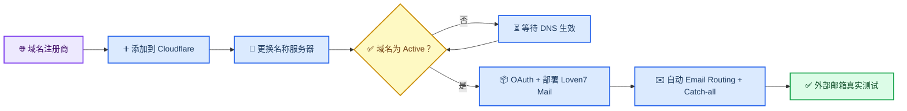
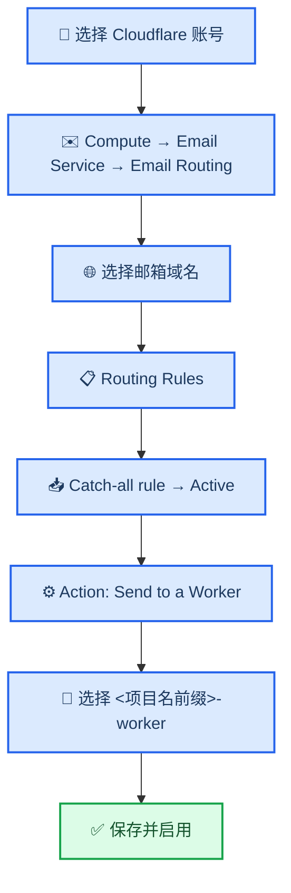

**简体中文** · [English](CLOUDFLARE_DOMAIN_AND_EMAIL_EN.md)

# 把域名托管到 Cloudflare 并开启邮箱路由

_面向第一次使用 Cloudflare 的部署者；先让域名变为 Active，再由安装器自动接通邮件路由。_

---

> ⚠️ **先确认：** 如果这个域名正在使用企业邮箱、个人邮箱、Google Workspace、Microsoft 365 或其他收件服务，不要直接启用新的 Email Routing。修改名称服务器或 MX 记录可能影响现有网站和邮件，请先迁移，或改用专门的邮箱子域名。

本页分成两部分：先让 Cloudflare 正式接管域名 DNS，再说明安装器如何自动把来信通过 Catch-all 交给 Loven7 Mail Worker，以及自动化失败时如何手工兜底。已经在 Cloudflare 中显示 **Active** 的域名，可以直接运行安装器。

## 🗺️ 完成路径



## 📋 开始前准备

| 需要准备 | 用来做什么 | 成功标准 |
| --- | --- | --- |
| 一个已经购买的域名 | 作为邮箱地址的 `@` 后缀 | 能登录域名注册商后台 |
| 一个 Cloudflare 账号 | 托管 DNS、Worker、D1、Pages 和 Email Routing | 能打开 [Cloudflare Dashboard](https://dash.cloudflare.com/) |
| 域名名称服务器修改权限 | 把 DNS 管理权交给 Cloudflare | 能找到 Nameservers / DNS Servers 设置 |
| 一个外部邮箱 | 最后发送真实测试邮件 | Gmail、Outlook、QQ 邮箱等均可 |

域名示例统一使用 `example.com`。实际操作时，换成你自己的根域名，不要输入 `https://`、网页路径或邮箱地址。

## 🌐 把域名托管到 Cloudflare

### 1. 在 Cloudflare 添加域名

1. 打开 [Cloudflare Dashboard](https://dash.cloudflare.com/) 并登录。
2. 打开 **Domains**，选择 **Onboard a domain**；旧版界面可能显示 **Add a domain**、**Add site** 或“添加域”。
3. 输入根域名，例如 `example.com`。
4. 如果要求选择套餐，新手可以先选择符合自己需求的套餐；本项目不要求购买特定付费套餐。
5. 让 Cloudflare 扫描现有 DNS 记录。

Cloudflare 官方把这个过程称为域名 Onboarding。界面名称以后可能调整，但核心结果不变：Cloudflare 会为这个域名分配两条权威名称服务器。[^1]

如果域名本来就是通过 Cloudflare Registrar 购买的，它通常已经自动使用 Cloudflare 权威 DNS，不需要去其他注册商替换名称服务器；确认域名状态为 Active 后，从“核对 DNS”继续即可。

### 2. 核对 Cloudflare 扫描到的 DNS

在继续之前，检查 Cloudflare 列出的记录：

- 网站正在使用的 `A`、`AAAA`、`CNAME` 记录是否还在
- 域名验证用的 `TXT` 记录是否还在
- 现有邮箱使用的 `MX` 和 SPF/DKIM/DMARC 记录是否还在

> ⚠️ **不要批量删除看不懂的记录。** 更换名称服务器后，Cloudflare 中的 DNS 会成为实际生效配置；漏掉记录可能导致网站或原邮箱服务中断。

### 3. 复制 Cloudflare 分配的名称服务器

Cloudflare 会显示两条类似下面的名称服务器：

```text
example-one.ns.cloudflare.com
example-two.ns.cloudflare.com
```

这里的值只是结构示例。必须复制你自己的 Cloudflare 页面实际显示的两条记录，不能照抄教程里的示例。

### 4. 如果注册商已启用 DNSSEC，先暂停旧 DNSSEC

在域名注册商检查 DNSSEC 或 DS record 状态。如果旧 DNS 服务启用了 DNSSEC，先按注册商说明关闭它并确认旧 DS 记录已移除，再替换名称服务器。带着旧 DS 记录直接切换名称服务器，可能导致域名暂时无法解析。域名在 Cloudflare 中变为 Active 后，可以再通过 Cloudflare 重新启用 DNSSEC。[^2]

没有启用 DNSSEC 时，直接继续下一步。

### 5. 到域名注册商替换名称服务器

1. 回到购买域名的平台。
2. 找到域名的 **Nameservers**、**Name Server**、**DNS Servers** 或“修改 DNS 服务器”。
3. 删除注册商原来的名称服务器。
4. 填入 Cloudflare 分配的两条名称服务器。
5. 保存修改。

这一操作是替换“名称服务器”，不是在注册商后台新增两条普通 DNS 记录。Cloudflare 的 Full setup 要求域名使用 Cloudflare 分配的权威名称服务器。[^2]

### 6. 等待域名变为 Active

返回 Cloudflare 域名概览页，等待状态从 **Pending nameserver update** 变为 **Active**。

在状态变为 Active 前：

- 不要运行 Loven7 Mail 的新 Worker 部署
- 不要开始配置 Email Routing
- 可以重新检查注册商是否保存了正确的两条名称服务器

名称服务器更新需要 DNS 传播时间。Cloudflare 页面显示 **Active** 才是本项目认可的完成条件。[^2]

### 域名托管完成检查

- [ ] 域名出现在正确的 Cloudflare 账号中
- [ ] 域名状态为 **Active**
- [ ] 网站和原有 DNS 记录没有异常
- [ ] 旧 DNSSEC/DS 记录已正确处理；需要时已在 Cloudflare 重新启用 DNSSEC
- [ ] 你知道是否允许本项目替换或新增邮件 MX 记录

## 📦 部署 Loven7 Mail

如果还没有部署项目，现在打开 [Loven7 Mail 小白完整部署教程](BEGINNER_GUIDE.md)，下载并双击 Windows 启动器。

安装器完成后会输出这些重要信息：

| 信息 | 示例 | 后续用途 |
| --- | --- | --- |
| Worker 地址 | `https://mail-worker.example.workers.dev` | Admin 与 Webmail 的后端地址（示例） |
| Email Routing 状态 | `已自动启用 example.com` | 说明 Catch-all 已绑定到 Worker |
| Admin 地址 | `https://loven7-mail-admin.example.pages.dev` | 管理邮箱、用户和邮件 |
| Webmail 地址 | `https://loven7-mail-webmail.example.pages.dev` | 用户登录和分享阅读 |

正常情况下无需再去 Cloudflare 下拉列表选择 Worker。Email Routing 绑定的是 Worker 服务名称，不依赖 `*.workers.dev` URL；但为了让部署顺序更直观、更安全，安装器仍会先部署并验收核心 Worker，取得公开地址后才修改邮件路由。

## ✉️ 自动 Email Routing 与手动兜底

全新 Worker 模式会先通过 OAuth 确定 Cloudflare 账号，再让用户输入这个账号里的 Active 域名。确认邮件接管风险后，安装器会：

1. 用不含 `addresses` 的配置部署核心 Worker，写入 Secret 并取得 `workers.dev` 地址。
2. 验证 Worker 健康状态、域名配置和首个管理员；失败时不会修改邮件 MX。
3. 逐域名调用 Cloudflare 官方 Email Routing 接口，启用必要邮件 DNS。
4. 在 Worker 配置中加入 `addresses = ["*@example.com"]`，使用锁定版 Wrangler 第二次部署，把 Catch-all 指向该 Worker。
5. 在线读取每个域名的规则，确认 Catch-all 已启用且目标 Worker 正确。
6. 如果已有 Catch-all、规则删除或接管冲突，停止并要求明确确认；拒绝时不修改原规则。

下面的 Dashboard 操作只用于自动配置失败、用户拒绝接管后自行处理，或真实收件排错。

### 手动兜底 1：打开域名的 Email Routing

1. 登录 Cloudflare Dashboard，进入要部署的账号。
2. 打开账号级的 **Compute → Email Service → Email Routing**。
3. 选择 **Onboard Domain**，再选择目标域名，例如 `example.com`。
4. 确认接入。旧版界面可能仍把入口放在域名内的 **Email → Email Routing**，并显示 **Get started** 或 **Enable Email Routing**。

Cloudflare 会检查或建议邮件所需的 DNS 记录。当前官方接入流程会为根域名配置 MX，以及用于 SPF 和 DKIM 的 TXT 记录；具体值始终以当前域名页面为准。[^3]

### 手动兜底 2：核对 Cloudflare 建议的邮件 DNS

在 Email Routing 页面查看记录状态：

| 记录 | 作用 | 操作原则 |
| --- | --- | --- |
| `MX` | 把发往域名的邮件交给 Cloudflare | 使用当前域名页面给出的准确值 |
| `TXT` / SPF | 授权 Cloudflare 参与邮件处理 | 按 Cloudflare 建议添加或合并 |
| `TXT` / DKIM | 为经 Cloudflare 处理的邮件提供身份验证 | 使用当前域名页面给出的名称和值 |

如果页面提供 **Add records automatically**，可以让 Cloudflare 自动添加。如果要求人工添加，就逐项复制页面给出的名称、类型、优先级和值。

> ⚠️ **不要从别人的教程复制 MX 值。** 以当前域名的 Cloudflare 页面为准。如果域名已有其他邮件 MX，请先确认迁移方案，避免两个收件系统互相冲突。

同一个主机名不应存在两条彼此独立的 `v=spf1` 记录。如果域名还要保留原发件服务，请按 Cloudflare 和原邮件服务商的说明合并授权，不要凭感觉拼接 SPF。

### 手动兜底 3：如果页面要求，先验证 Destination Address

全新账号在创建 Routing Rule 前，可能要求账号中至少有一个已验证的 **Destination Address**。如果页面出现这个提示：

1. 打开 **Destination Addresses**。
2. 填写一个你能正常收信的外部邮箱，例如 Gmail、Outlook 或 QQ 邮箱。
3. 打开 Cloudflare 发来的验证邮件，点击 **Verify email address**。
4. 返回 Email Routing，确认该地址状态已验证。

这个地址只用于满足 Cloudflare 的账号级验证或普通转发规则，不是 Loven7 Mail 的存储位置。下一步仍然要把 Catch-all 的 Action 设为 **Send to a Worker**。账号中已经存在已验证地址，或页面允许直接选择 Worker 时，可以跳过本节。[^4]

### 手动兜底 4：把 Catch-all 指向 Worker



仅在自动配置没有完成时，按下面的顺序操作：

1. 在 Email Routing 中选择邮箱域名，再打开 **Routing Rules**。
2. 找到 **Catch-all rule**，将状态设为 **Active**；旧版界面可能显示 **Catch-all address → Edit**。
3. 将 **Action** 改为 **Send to a Worker**。
4. 选择安装器输出的 Worker，例如 `loven7-mail-worker`。
5. 保存，并确认 Catch-all 仍为 Active。
6. 如果安装器填写了多个域名，对每个域名重复这些操作，并选择同一个 Worker。

Catch-all 表示这个域名下没有单独规则匹配的邮件都会进入 Worker。因此不需要在 Cloudflare Email Routing 中为每个临时邮箱逐个建立转发地址；邮箱地址应在 Loven7 Mail Admin 中创建。Cloudflare 的 Routing rules 支持将 Catch-all 操作设置为 Worker。[^4]

### Worker 没有出现在列表中

依次确认：

1. 安装器和域名使用的是同一个 Cloudflare 账号。
2. **Workers & Pages** 中确实存在 `<项目名前缀>-worker`。
3. Worker 部署状态正常，没有停留在失败版本。
4. 刷新 Email Routing 页面后重新编辑 Catch-all。

不要随便选择名字相似但来源不明的 Worker。

## ✅ 发送第一封真实邮件

1. 打开安装器输出的 Admin 地址。
2. 使用安装时创建的管理员账号登录。
3. 创建一个邮箱地址，例如 `first-test@example.com`。
4. 使用 Gmail、Outlook、QQ 邮箱等外部邮箱发送一封主题唯一的邮件。
5. 在 Admin 或 Webmail 中确认发件人、主题、正文和时间正确。
6. 多域名部署时，每个域名至少测试一次。

完整链路应当是：

```mermaid
flowchart LR
    accTitle: 真实邮件收件链路
    accDescr: 外部邮箱通过 Cloudflare MX 和 Email Routing 进入 Catch-all Worker，写入 D1，最后由 Admin 和 Webmail 展示。

    sender["📨 外部邮箱"] --> mx["🌐 Cloudflare MX"]
    mx --> routing["✉️ Email Routing"]
    routing --> worker["⚙️ Catch-all Worker"]
    worker --> d1["💾 D1 数据库"]
    d1 --> apps["✅ Admin / Webmail"]

    classDef process fill:#dbeafe,stroke:#2563eb,stroke-width:2px,color:#1e3a5f
    classDef success fill:#dcfce7,stroke:#16a34a,stroke-width:2px,color:#14532d

    class sender,mx,routing,worker,d1 process
    class apps success
```



## 🔍 收不到邮件时检查

| 现象 | 最常见原因 | 检查位置 |
| --- | --- | --- |
| Email Routing 无法接入域名 | 域名不是 Active，或名称服务器未生效 | Domains → 对应域名 |
| MX 显示冲突 | 域名仍有其他邮件服务的 MX | DNS → Records |
| 无法创建或启用 Routing Rule | Cloudflare 要求先验证 Destination Address | Email Routing → Destination Addresses |
| Worker 不在下拉列表 | Worker 在另一个账号，或部署未成功 | Workers & Pages |
| 页面可打开但没有邮件 | Catch-all 未启用或没有指向正确 Worker | Compute → Email Service → Email Routing → Routing Rules |
| 只有一个域名能收件 | 某个域名自动启用失败或规则被后来修改 | 每个域名的 Email Routing |
| `/api/runtime` 为 `ok: true` 但收不到 | Pages 配置正常，不代表公网投递正常 | MX、Email Routing 和 Worker Logs |

可以打开 **Workers & Pages → 对应 Worker → Logs**，然后重新发送测试邮件。如果完全没有新日志，优先检查 MX、Email Routing 和 Catch-all；如果有日志但报错，再检查 Worker、D1 和管理员配置。

## 📚 下一步

- [Loven7 Mail 小白完整部署教程](BEGINNER_GUIDE.md)：从下载启动器到完成验收
- [新手安装器说明](INSTALLER.md)：断点续装、安全边界和资源复用
- [Cloudflare Pages 配置](CLOUDFLARE_PAGES.md)：变量、Secret、KV 和运行时探针

## 🔗 官方参考

[^1]: Cloudflare. “Onboard a domain.” https://developers.cloudflare.com/fundamentals/manage-domains/add-site/

[^2]: Cloudflare. “Change your nameservers (Full setup).” https://developers.cloudflare.com/dns/zone-setups/full-setup/setup/

[^3]: Cloudflare. “Route emails.” https://developers.cloudflare.com/email-service/get-started/route-emails/

[^4]: Cloudflare. “Email routing rules and addresses.” https://developers.cloudflare.com/email-service/configuration/email-routing-addresses/

---

_最后核对：2026-08-16；Cloudflare 控制台文案可能调整，以页面实际显示和官方文档为准。_
