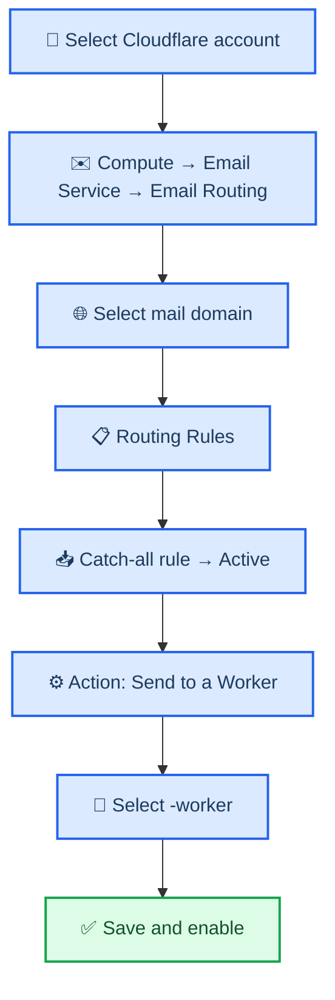

**English** · [简体中文](CLOUDFLARE_DOMAIN_AND_EMAIL.md)

# Host a Domain on Cloudflare and Connect Email Routing

_For first-time Cloudflare users: make the domain Active first, then let the Loven7 Mail installer connect Email Routing automatically._

---

> ⚠️ **Migration warning:** do not enable a new Email Routing setup on a domain that currently uses business email, personal mail hosting, Google Workspace, Microsoft 365, or another receiving provider without a migration plan. Changing nameservers or MX records can interrupt websites and email. Use a dedicated domain or a carefully planned mail subdomain when needed.

This guide has two parts:

1. move authoritative DNS to Cloudflare and wait for the domain to become **Active**;
2. understand how the installer connects Catch-all to Loven7 Mail and how to verify it manually if automation cannot finish.

If the domain already shows **Active** in Cloudflare, continue with the [complete beginner deployment guide](BEGINNER_GUIDE_EN.md).

## 🗺️ End-to-end path

```mermaid
flowchart LR
    accTitle: Connect a domain to Loven7 Mail
    accDescr: Add a registrar-managed domain to Cloudflare, replace nameservers, wait for Active status, deploy Loven7 Mail through OAuth, connect Email Routing Catch-all, and send a real test email.

    registrar["🌐 Domain registrar"] --> add_site["➕ Add domain to Cloudflare"]
    add_site --> nameservers["🔁 Replace nameservers"]
    nameservers --> active{"✅ Domain Active?"}
    active -->|No| wait_dns["⏳ Wait for DNS propagation"]
    wait_dns --> active
    active -->|Yes| installer["📦 OAuth + deploy Loven7 Mail"]
    installer --> email_routing["✉️ Automatic Email Routing + Catch-all"]
    email_routing --> real_test["✅ External real-mail test"]

    classDef source fill:#ede9fe,stroke:#7c3aed,stroke-width:2px,color:#3b0764
    classDef process fill:#dbeafe,stroke:#2563eb,stroke-width:2px,color:#1e3a5f
    classDef decision fill:#fef9c3,stroke:#ca8a04,stroke-width:2px,color:#713f12
    classDef success fill:#dcfce7,stroke:#16a34a,stroke-width:2px,color:#14532d

    class registrar source
    class add_site,nameservers,wait_dns,installer,email_routing process
    class active decision
    class real_test success
```



## 📋 Requirements and migration warning

| Prepare | Purpose | Ready when |
| --- | --- | --- |
| A domain you already own | Becomes the `@domain` part of mailbox addresses | You can sign in to the registrar |
| A Cloudflare account | Hosts DNS, Worker, D1, Pages, KV, and Email Routing | You can open the [Cloudflare Dashboard](https://dash.cloudflare.com/) |
| Permission to change nameservers | Delegates authoritative DNS to Cloudflare | You can find Nameservers or DNS Servers at the registrar |
| An external mailbox | Sends the final real-mail test | Gmail, Outlook, QQ Mail, or another independent provider works |

Examples use `example.com`. Replace it with your root domain. Do not enter `https://`, a URL path, or a complete email address.

Before changing anything, identify whether the domain currently provides:

- a website;
- business or personal receiving email;
- outbound email with SPF, DKIM, or DMARC;
- verification TXT records;
- DNSSEC at the current DNS provider.

Keep the records required by those services. Do not delete records simply because their purpose is unfamiliar.

## 🌐 Host the domain on Cloudflare

### 1. Add the domain

1. Sign in to the [Cloudflare Dashboard](https://dash.cloudflare.com/).
2. Open **Domains**.
3. Select **Onboard a domain**. Older interfaces may say **Add a domain** or **Add site**.
4. Enter the root domain, for example `example.com`.
5. Select a suitable plan. Loven7 Mail does not require a specific paid plan.
6. Allow Cloudflare to scan the existing DNS records.

Cloudflare calls this process domain onboarding.[^1]

If you purchased the domain through Cloudflare Registrar, it normally already uses Cloudflare authoritative DNS. Confirm that it is Active, verify the scanned DNS records, and skip the external nameserver-replacement step.

### 2. Verify imported DNS records

Before continuing, confirm that Cloudflare imported the records you still need:

- `A`, `AAAA`, and `CNAME` records used by websites;
- validation `TXT` records;
- existing `MX` records;
- SPF, DKIM, and DMARC records.

> ⚠️ After the nameserver change, the Cloudflare DNS list becomes the live source of truth. A missing record can interrupt a website or existing mail service.

### 3. Copy Cloudflare's assigned nameservers

Cloudflare displays two authoritative nameservers similar to:

```text
example-one.ns.cloudflare.com
example-two.ns.cloudflare.com
```

These are structural examples only. Copy the two exact nameservers shown for your domain.

### 4. Handle old DNSSEC before switching

Check whether the registrar has DNSSEC or a DS record enabled for the old DNS provider.

If it does:

1. disable the old DNSSEC configuration according to the registrar's instructions;
2. confirm that the old DS record has been removed;
3. replace the nameservers;
4. wait until Cloudflare shows Active; and
5. enable DNSSEC again through Cloudflare if you need it.

Keeping an old DS record while changing authoritative nameservers can temporarily make the domain fail DNS validation.[^2]

If DNSSEC is not enabled, continue to the next step.

### 5. Replace nameservers at the registrar

1. Return to the platform where you purchased the domain.
2. Find **Nameservers**, **Name Server**, **DNS Servers**, or a similarly named setting.
3. Remove the registrar's current nameservers.
4. Enter the two nameservers assigned by Cloudflare.
5. Save the change.

This replaces authoritative nameservers. It is not the same as adding two ordinary DNS records. Cloudflare Full setup requires the assigned Cloudflare nameservers.[^2]

### 6. Wait for Active status

Return to the domain overview in Cloudflare. Wait for **Pending nameserver update** to become **Active**.

Before the domain is Active:

- do not start a new-Worker Loven7 Mail installation;
- do not configure Email Routing;
- recheck that the registrar saved both nameservers exactly.

Nameserver updates require DNS propagation time. For this project, **Active** is the required completion state.[^2]

### Domain onboarding checklist

- [ ] The domain appears in the intended Cloudflare account.
- [ ] Its Cloudflare status is **Active**.
- [ ] The website and existing DNS records still work.
- [ ] Old DNSSEC/DS records were handled correctly.
- [ ] You know whether Loven7 Mail is allowed to replace or add mail MX records.

## 📦 Deploy Loven7 Mail

Open the [complete beginner deployment guide](BEGINNER_GUIDE_EN.md), download `Install-Loven7-Mail.cmd`, and run it on Windows.

The installer prints these important values:

| Output | Example | Purpose |
| --- | --- | --- |
| Worker URL | `https://mail-worker.example.workers.dev` | Backend used by Admin and Webmail |
| Email Routing status | `example.com enabled` | Confirms Catch-all was bound to the Worker |
| Admin URL | `https://loven7-mail-admin.example.pages.dev` | Manage mailboxes, users, mail, and settings |
| Webmail URL | `https://loven7-mail-webmail.example.pages.dev` | User login and shared-mail reading |

Normally, you do not need to select a Worker manually. Email Routing binds the Worker service name rather than relying on the `*.workers.dev` URL. The installer still obtains and verifies the public Worker endpoint before it changes mail routing.

## ✉️ Automatic Email Routing and manual fallback

In new-Worker mode, the installer uses OAuth to identify the Cloudflare account, then asks for Active domains from that account. After you approve the mail-takeover risk, it:

1. deploys a core Worker configuration with no `addresses` routes;
2. uploads secrets and obtains the `workers.dev` endpoint;
3. verifies Worker health, domain configuration, and the first administrator;
4. enables Email Routing and required mail DNS for each domain;
5. adds `addresses = ["*@example.com"]` and deploys again with the pinned Wrangler version;
6. reads the live rule and verifies that Catch-all is Active and targets the expected Worker; and
7. stops for explicit confirmation if an existing Catch-all or destructive routing change conflicts.

If core verification fails, mail MX and Catch-all are not changed.

Use the following Dashboard procedures only when:

- automatic setup failed;
- you declined takeover and now want to handle the conflict manually; or
- a real external email does not arrive.

### Manual fallback 1: Open Email Routing

1. Sign in to Cloudflare and select the correct account.
2. Open **Compute → Email Service → Email Routing**.
3. Select **Onboard Domain** and choose the mail domain.
4. Confirm onboarding.

Older Cloudflare interfaces may place the feature under the domain's **Email → Email Routing** page and use **Get started** or **Enable Email Routing**.

Cloudflare checks or proposes the DNS records required for mail. The current onboarding flow configures root-domain MX records and TXT records used by SPF and DKIM. Follow the exact values displayed for your domain.[^3]

### Manual fallback 2: Verify mail DNS

| Record | Purpose | Rule |
| --- | --- | --- |
| `MX` | Delivers incoming domain mail to Cloudflare | Use the exact priorities and values shown on the domain's Email Routing page |
| `TXT` / SPF | Authorizes services participating in outbound handling | Add or merge according to Cloudflare and your existing sender |
| `TXT` / DKIM | Provides mail authentication | Use the exact hostname and value displayed by Cloudflare |

If Cloudflare offers **Add records automatically**, you may let it add them. Otherwise, copy every name, type, priority, and value exactly.

> ⚠️ Do not copy MX values from another tutorial or domain. If other mail-provider MX records already exist, confirm the migration plan before replacing them.

A hostname should not have two independent `v=spf1` records. If another outbound provider must remain authorized, follow both providers' documented merge procedure.

### Manual fallback 3: Verify a Destination Address if requested

A new Cloudflare account may require one verified **Destination Address** before routing rules can be created.

If Cloudflare displays this requirement:

1. open **Destination Addresses**;
2. enter an external mailbox you can access;
3. open Cloudflare's verification message;
4. select **Verify email address**; and
5. return to Email Routing and confirm the verified status.

This address satisfies the account-level verification requirement or ordinary forwarding rules. It is not where Loven7 Mail stores messages. Catch-all must still use **Send to a Worker**. If a verified address already exists or Cloudflare allows direct Worker selection, skip this step.[^4]

### Manual fallback 4: Point Catch-all to the Worker



Only when automation did not finish:

1. select the mail domain in Email Routing;
2. open **Routing Rules**;
3. find **Catch-all rule** and set it to **Active**;
4. set **Action** to **Send to a Worker**;
5. select the Worker printed by the installer, such as `loven7-mail-worker`;
6. save and confirm that Catch-all remains Active; and
7. repeat for every mail domain, selecting the same Worker.

Catch-all sends any address without a more specific matching rule to the Worker. Do not create a separate Cloudflare forwarding rule for every temporary address. Create mailbox addresses in Loven7 Mail Admin instead.[^4]

### The Worker is missing from the list

Check:

1. the domain and installer use the same Cloudflare account;
2. **Workers & Pages** contains `<project-prefix>-worker`;
3. the latest Worker deployment succeeded;
4. the Worker was not renamed or deleted; and
5. the Email Routing page has been refreshed.

Do not choose an unknown Worker with a similar name.

## ✅ Send the first real email

1. Open the Admin URL printed by the installer.
2. Sign in with the administrator account created during installation.
3. Create a mailbox such as `first-test@example.com`.
4. Send a uniquely titled message from Gmail, Outlook, QQ Mail, or another external provider.
5. Confirm the sender, subject, body, and time in Admin or Webmail.
6. For multiple domains, test at least one mailbox on every domain.

The complete delivery path is:

```mermaid
flowchart LR
    accTitle: Real incoming email path
    accDescr: An external sender reaches Cloudflare MX and Email Routing, Catch-all invokes the Worker, the Worker writes D1, and Admin or Webmail displays the message.

    sender["📨 External mailbox"] --> mx["🌐 Cloudflare MX"]
    mx --> routing["✉️ Email Routing"]
    routing --> worker["⚙️ Catch-all Worker"]
    worker --> d1["💾 D1 database"]
    d1 --> apps["✅ Admin / Webmail"]

    classDef process fill:#dbeafe,stroke:#2563eb,stroke-width:2px,color:#1e3a5f
    classDef success fill:#dcfce7,stroke:#16a34a,stroke-width:2px,color:#14532d

    class sender,mx,routing,worker,d1 process
    class apps success
```



## 🔍 Troubleshooting no mail

| Symptom | Likely cause | Check |
| --- | --- | --- |
| Email Routing cannot onboard the domain | Domain is not Active or nameservers have not propagated | Domains → target domain |
| MX conflict | Another provider's MX records are still present | DNS → Records |
| Routing Rule cannot be enabled | Cloudflare requires a verified Destination Address | Email Routing → Destination Addresses |
| Worker is absent from the selector | Worker is in another account or its deployment failed | Workers & Pages |
| Pages open, but no email appears | Catch-all is disabled or points to the wrong Worker | Email Routing → Routing Rules |
| Only one domain receives mail | Routing failed or was later changed on another domain | Inspect Email Routing for each domain |
| `/api/runtime` is `ok: true`, but mail does not arrive | Pages runtime is healthy, but public MX delivery is not | MX, Email Routing, and Worker Logs |

Open **Workers & Pages → your Worker → Logs**, then send another test message.

- No new log entry usually indicates an MX, Email Routing, or Catch-all problem.
- A log entry with an exception usually indicates Worker, D1, secret, or domain configuration.

## 📚 Next steps

- [Complete beginner deployment guide](BEGINNER_GUIDE_EN.md): download, install, and verify the entire system.
- [Installer reference](INSTALLER.md): checkpoints, safety boundaries, and resource reuse; currently Chinese.
- [Cloudflare Pages configuration](CLOUDFLARE_PAGES.md): variables, secrets, KV, and runtime probes; currently Chinese.

## 🔗 Official Cloudflare references

[^1]: Cloudflare. “Onboard a domain.” https://developers.cloudflare.com/fundamentals/manage-domains/add-site/

[^2]: Cloudflare. “Change your nameservers (Full setup).” https://developers.cloudflare.com/dns/zone-setups/full-setup/setup/

[^3]: Cloudflare. “Route emails.” https://developers.cloudflare.com/email-service/get-started/route-emails/

[^4]: Cloudflare. “Email routing rules and addresses.” https://developers.cloudflare.com/email-service/configuration/email-routing-addresses/

---

_Last verified: August 16, 2026. Cloudflare may change Dashboard labels; follow the current interface and official documentation when wording differs._
